 

### UNIVERSIDAD MEXIQUENSE DEL BICENTENARIO
### UNIDAD DE ESTUDIOS SUPERIORES SAN JOSÉ DEL RINCÓN
## **FUNDAMENTOS DE PROGRAMACIÓN**
# **GUÍA DE LENGUAJES**
### **CARRERA:** INGENIERÍA EN SISTEMAS COMPUTACIONALES
### **ALUMNO:** MIGUEL ÁNGEL PASCUAL MARTÍNEZ
### **DOCENTE:** EDUARDO BECERRIL ROMERO 
### **GRUPO:** 13SC111

---
## **INTRODUCCIÓN**
El presente proyecto es realizado en el primer semestre universitario de la carrera de Ingeniería en Sistemas Computacionales, elaborado en la última evaluación parcial de la asignatura **Fundamentos de Programación**. Este proyecto tiene la finalidad de transmitir conocimienos básicos sobre la programación a las personas que han decidido adentrarse en el mundo de la programación, o que estan iniciando una carrera universitaria afín. El proyecto ayuda al lector a informarse sobre las herramientas que puede usar para el desarrollo de software y las alternativas con las que cuenta.

---
## **OBJETIVOS**
1. Brindar al lector información escencial que le aporte conocimientos básicos pero escenciales si desea integrarse al desarrollo de software.
2. Informar sobre algunos de los paradigmas de programación que existen.
3. Proporcionar información importante de lenguajes de programación que estan teniendo más impacto en el mundo de la programación.
4. Dar a conocer algunos ejemplos de algoritmos desarrollados en diferentes lenguajes de programación.

---
## **ÍNDICE**
1. Introducción
2. Objetivos
3. Índice
4. Conceptos básicos
    * Programación
        - ¿Qué es?
        - ¿Para qué sirve?
        - Historia
    - Algoritmos
    - Diagramas de flujo
    - Lenguaje de programación
    - Paradigmas de programación
        - Programación Orientada a Objetos
        - Programación Orientada a Eventos
        - Programación Reactiva
    - Lenguajes compilados
    - Lenguajes interpretados
5. Editores de texto
    - Visual Studio Code
    - Atom
    - Sublime Text
6. Guía de lenguajes
7. Python
    - ¿Qué es python?
    - Paradigmas que se pueden implementar
    - Aplicaciones comunes del lenguaje
    - Pros y contras vs otros lenguajes
    - Instalación
    - Configuración
        - Entorno (Sistema operativo)
        - Entorno (Editor de texto)
    - Hola mundo
    - Comandos de ejecución de un programa
    - 10 Algoritmos de ejemplo
8. C++
    - ¿Qué es c++?
    - Paradigmas que se pueden implementar
    - Aplicaciones comunes del lenguaje
    - Pros y contras vs otros lenguajes
    - Instalación
    - Configuración
        - Entorno (Sistema operativo)
        - Entorno (Editor de texto)
    - Hola mundo
    - Comandos de compilación y ejecución de un programa
    - 10 Algoritmos de ejemplo
9. Javascript
    - ¿Qué es javascript?
    - Paradigmas que se pueden implementar
    - Aplicaciones comunes del lenguaje
    - Pros y contras vs otros lenguajes
    - Instalación
    - Configuración
        - Entorno (Sistema operativo)
        - Entorno (Editor de texto)
    - Hola mundo
    - Proceso de ejecución de un programa
    - 10 Algoritmos de ejemplo
10. PHP
    - ¿Qué es PHP?
    - Paradigmas que se pueden implementar
    - Aplicaciones comunes del lenguaje
    - Pros y contras vs otros lenguajes
    - Instalación
    - Configuración
        - Entorno (Sistema operativo)
        - Entorno (Editor de texto)
    - Hola mundo
    - Proceso de ejecución de un programa
    - 10 Algoritmos de ejemplo
11. Ensamblador
    - ¿Qué es ensamblador?
    - Paradigmas que se pueden implementar
    - Aplicaciones comunes del lenguaje
    - Pros y contras vs otros lenguajes
    - Instalación
    - Configuración
        - Entorno (Sistema operativo)
        - Entorno (Emulador emu8086)
    - Hola mundo
    - Proceso de ejecución de un programa con emu8086
    - 5 Algoritmos de ejemplo
12. Conclusiones
13. Bibliografía

---
## **CONCEPTOS BÁSICOS**
## PROGRAMACIÓN
### ¿QUÉ ES?
La programación es el proceso de darle instrucciones a un computador para que éste realice una tarea en especifico, las instrucciones son dadas a través de software de desarrollo conocido mejor como lenguaje de programación.

### HISTORIA
La programación como tal con un lenguaje de programación se dió por primera vez en 1957 con el científico John W. Backus, cuando creó el primer lenguaje de programación de alto nivel para entonces, Fortran. Su finalidad era clarificar y facilitar la comprensión (ante los lenguajes erráticos e indescifrables de la época), acercándolo a una notación matemática normal.
Más tarde, en 1964 nació BASIC, familia de lenguajes de programación que surgió como una herramienta de apoyo enfocada a la enseñanza pero que acabo adquiriendo una relevancia sorprendente, hasta el punto de que, a día de hoy, sigue siendo utilizado en programas como “Gambas” o “Visual Basic”.
En 1970 tuvo lugar la creación de Pascal, que al igual que BASIC, nació como una herramienta de enseñanza que pronto pasó a utilizarse para el desarrollo de aplicaciones. A pesar de que su influencia se ha visto reducida con el paso del tiempo, se sigue utilizando sobre todo en escuelas de programación.
En 1972 llegó el lenguaje C, y el resto es historia. C fue creado por Dennis Ritchie como un lenguaje básico de programación, de un nivel no muy complejo, que pronto adquiriría una relevancia vital, hasta acabar convirtiéndose en uno de los lenguajes más utilizados en la actualidad.
Finalmente en 1979 tiene lugar otro hito histórico para la programación: se crea el lenguaje C++ con la idea de añadir al lenguaje C mecanismos para manipular objetos.
Con la llegada de 1990 y la década de internet, fueron numerosos los nuevos lenguajes de programación que surgieron. Muchos de ellos alcanzaron una gran popularidad y siguen siendo masivamente utilizados actualmente. Entre ellos destacamos algunos como HTML, Python, Visual Basic, Java, JavaScript o PHP que están presentes en casi la totalidad de páginas web y aplicaciones en la actualidad.
Finalmente, desde la entrada en el siglo XXI, la creación de lenguajes de programación se ha visto mermada como consecuencia de la gran completitud de los lenguajes ya diseñados. Hechos relevantes fueron los siguientes:
Creación de C# en 2001.
Scratch, lenguaje de programación creado en 2006 con una complejidad más reducida para facilitar un aprendizaje más visual para niños, adolescentes y adultos.
Go de Google en 2009
Kotlin en 2012, hoy bautizado como uno de los mejores lenguajes para programar en Android.
Swift en 2013, creado por Apple para programar en iOS.
Actualmente, son muchos los lenguajes de programación utilizados, cada uno especializado en una función diferente. 

## ALGORITMOS
En pocas palabras, un algoritmo son los pasos a seguir para dar solución a un determinado problema, es preciso, claro y finito, es decir tiene un inicio y un final.

## DIAGRAMAS DE FLUJO
Un diagrama de flujo es la representación gráfica de un algoritmo, un diagrama de flujo esta constituido por diferentes figuras, cada una simbolizando algo en espeficico, por ejemplo los ovalos representan el inicio y final del diagrama, un rectángulo representa un proceso, un romboide representa una entrada o salida de datos, un rombo simboliza una decisión y las flechas son usadas para dar a conocer el sentido del flujo del diagrama. 


## LENGUAJE DE PROGRAMACIÓN
El lenguaje de programación es un software de desarrollo, el cual es utilizado para poder darle instrucciones a un computador para que realice tareas indicadas por un programador. Existen distintos lenguajes de programación, cada uno con un cierto proposito y con una forma diferente o similar de especificar las instrucciones, esto se le conoce como sintaxis, y por lo general es parecido al lenguaje humano, sin embargo algunos lenguajes de programación tienen su sintaxis más parecida al lenguaje máquina, con esto se puede diferenciar al lenguaje de programación entre un lenguaje de alto nivel (más parecido al lenguaje humano y es fácil de comprender) y lenguaje de bajo nivel (más parecido al lenguaje máquina y es un poco complejo de entender). Otra manera en que se clasifican los lenguajes de programación es en base a su forma de ejecución, se dividen en lenguajes de programación compilados e interpretados.

## PARADIGMAS DE PROGRAMACIÓN
Un paradigma de programación es tan solo la manera o estilo en que se programa, puede ser usando objetos, eventos, procedimientos, funciones, entre otras cosas, pero algunas de las más conocidas son las siguientes:

### PROGRAMACIÓN ORIENTADA A OBJETOS
La programación orientada o objetos o POO consiste en la implementación de objetos para dar solución a la problematica que se quiere resolver. Un objeto es la abstracción de un elemento de la vida real, éste tiene un identificador, atributos y comportamientos. La POO posee cuatro pilares, los cuales son la encapsulación, la abstracción, el polimorfismo y la herencia.

### PROGRAMACIÓN ORIENTADA A EVENTOS
En la programación orientada a eventos se encuentran tres elementos importantes, los eventos, los componentes y los metodos. Es un paradigma el cual se enfoca en funcionar dependiendo de los sucesos o acciones que ocurren en el programa y que son causados por los usuarios o por el programa. Los eventos son las acciones que ocurren, como dar clic sobre algo, introducir texto, etc, y cada acción es hecha por el usuario o el mismo programa, los componentes son los elementos con los cuales se puede interactuar y causar un tipo de evento en cada uno, y por ultimo los metodos son las funciones que cada elemento posee, por ejemplo un cuadro de texto, al ingresar un texto, éste puede tener un metodo que lo almacene, otro que lo borre, otro que lo evalue, etc.

### PROGRAMACIÓN REACTIVA
La programación reactiva es un paradigma enfocado en el trabajo con flujos de datos finitos o infinitos de manera asíncrona. Algunos de los elementos escenciales que los programas reactivos deben tener es que deben ser:  
**Responsivos:** deben de asegurar la calidad del servicio cumpliendo unos tiempos de respuesta establecidos.  
**Resilientes:** mantenerse responsivos incluso cuando se enfrentan a situaciones de error.  
**Elásticos:** mantenerse responsivos incluso ante aumentos en la carga de trabajo.  
**Orientados a mensajes:** minimizan el acoplamiento entre componentes al establecer interacciones basadas en el intercambio de mensajes de manera asíncrona.  
La motivación detrás de este nuevo paradigma procede de la necesidad de responder a las limitaciones de escalado presentes en los modelos de desarrollo actuales, que se caracterizan por su desaprovechamiento del uso de la CPU.

## LENGUAJES COMPILADOS
Los lenguajes de programación compilados son aquellos que deben pasar a través de un copilador que convierte los codigos dados por el programador a un lenguaje que el ordenador pueda comprender, de esta manera la ejecución de los programas suele ser mas rápida en comparación de los lenguajes interpretados.  

  

## LENGUAJES INTERPRETADOS
Los lenguajes de programación interpretados son aquellos que no necesitan pasar a través de un compilador, por lo que al ejecutarse, un interprete va interpretando el código línea por línea del programa en el momento de la ejecución, esto hace que su ejecución sea más lenta que la de los lenguajes compilados, pero con el paso del tiempo se ha ido haciendo cada vez más rapida en su ejecución.  

    

## **EDITORES DE TEXTO**
## VISUAL STUDIO CODE
Visual Studio Code (VS Code) es un editor de código fuente desarrollado por Microsoft. Es software libre y multiplataforma, está disponible para Windows, GNU/Linux y macOS. VS Code tiene una buena integración con Git, cuenta con soporte para depuración de código, y dispone de un sinnúmero de extensiones, que básicamente te da la posibilidad de escribir y ejecutar código en cualquier lenguaje de programación.


## ATOM
Atom es un editor de código de fuente abierta para macOS, Linux, y Windows con soporte para plug-ins escrito en Node.js, Incrustando Git Control, desarrollado por GitHub. Es una aplicacion de escritorio construida utilizando tecnologias web. Está basado en Electrón (Anteriormente conocido como Atom Shell),Un framework que permite aplicaciones de escritorio multiplataforma usando Chromium y Node.js. También puede ser utilizado como un entorno de desarrollo integrado (IDE).


## SUBLIME TEXT
Sublime Text es un editor de texto para escribir código en casi cualquier formato de archivo. Está especialmente pensado para escribir sin distracciones. Es decir, que visualmente ofrece un entorno oscuro donde las líneas de código que escribas resaltarán para que puedas centrarte exclusivamente en ellas. De una forma sencilla podemos decir que Sublime Text, es un editor de texto ligero, pensado desde un inicio en la velocidad, haciendolo uno de los editores de texto más rápido y facil de usar. Además de la velocidad se tiene más de 1000 de plugins adicionales y todos de codigo abierto, con una comunidad de desarrolladores que día a día contribuyen desarrollando nuevos plugins los cuales proveen de mas funcionalidad a este progrema. Sublime Text es multiplataforma, disponible para Linux, Windows y XO S. Es un programa de pago, la licencia individual cuesta 70$ aunque se puede descargar una versión de prueba que tiene tiempo ilimitado.


> ### NOTA: Para poder llevar a cabo la guía de lenguajes, se estará haciendo uso del editor de texto VSCode, sin embargo usted puede usar el de su preferencia.  

1. Para descargar VSCode usted debe dirigirse a la página oficial de VSCode en el siguiente enlace [https://code.visualstudio.com/](https://code.visualstudio.com/ "Descargar Visual Studio Code")  

2. Estando en la página, usted dara clic en ***descargar***. Haciendo esto, comenzara la descarga.  

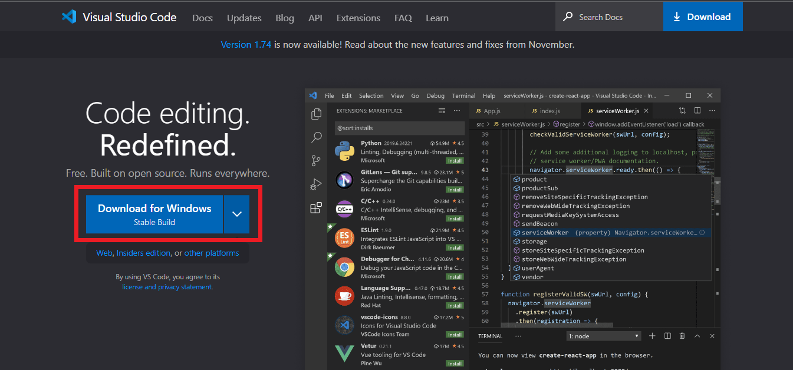  

3. Una vez descargado, buscaremos en nuestras carpetas el instalador de VSCode, normalmente se guarda en ***descargas***.  

  

4. Al encontrar el instalador, le daremos doble clic para comenzar con la instalación. Lo primero que nos aparecera será la siguiente ventana, debemos dar clic en ***Acepto el acuerdo***. Y dar clic en ***siguiente***

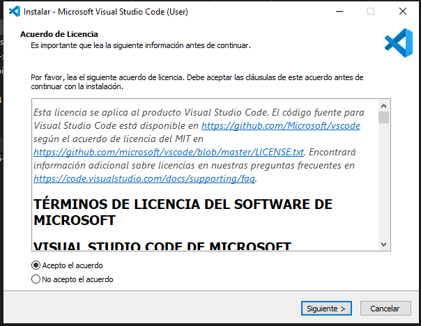  

5. Ahora nos aparecerá lo siguiente, debemos marcar las tres casillas señaladas, y dar clic en ***siguiente***:  

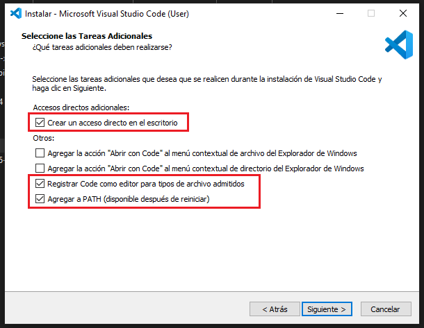  

6. Ahora le aparecerá un ventana que le pedirá donde se creará la carpeta para VSCode, usted puede seleccionar una ruta diferente o dejarla por defecto, después de eso dar clic en ***siguiente***.  

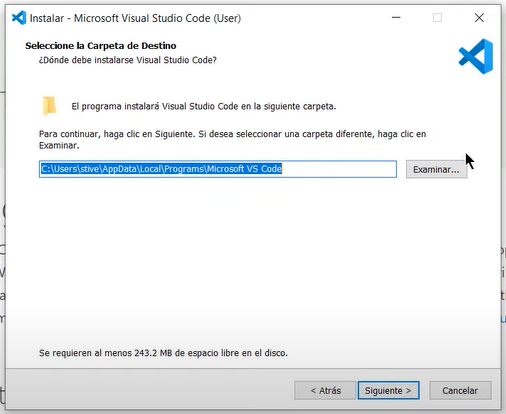  

7. Le aparecerá la siguiente ventana, unicamente dara clic en ***instalar**.  

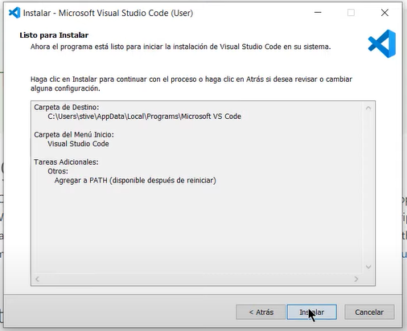  

8. Debe esperar un momento a que concluya la instalación. 

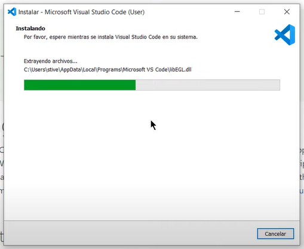 

9. Al finalizar la instalación, usted dará clic en ***finalizar***.

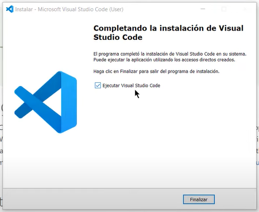  

10. El editor de texto se ejecutará para que pueda iniciar a utlizarlo. 

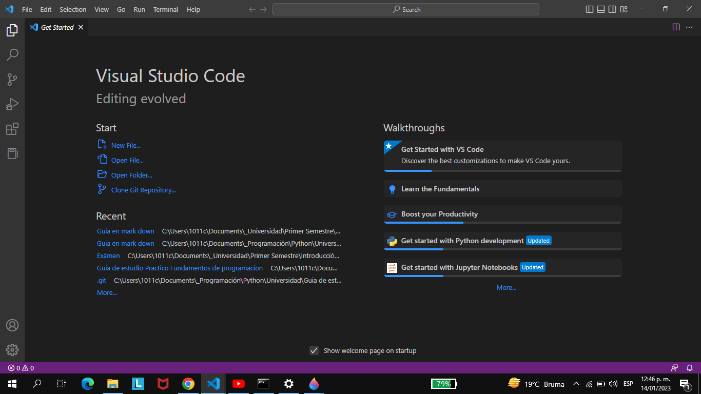

Para iniciar con la guía de lenguajes, necesitamos una carpeta donde guardaremos los programas que haremos a continuación, para eso haremos lo siguiente:

1. Nos dirigiremos al escritorio, es decir la pantalla principal del ordenador y daremos un clic derecho, seleccionamos ***nuevo*** y seleccionamos ***carpeta***.

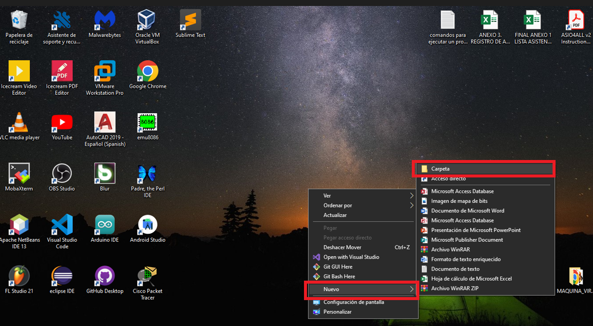  

2. A la carpeta le pondremos de nombre ***codigos***.

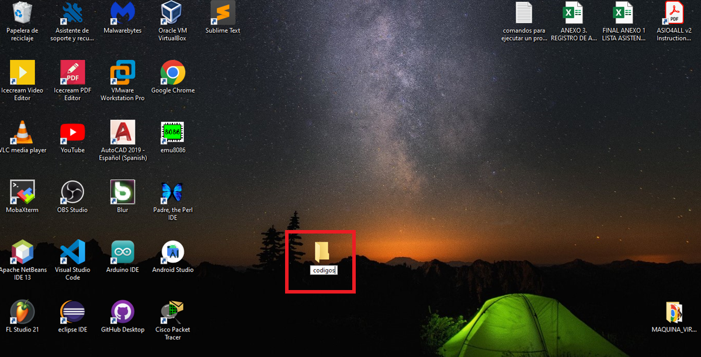

## **GUÍA DE LENGUAJES**
## PYTHON
### ¿QUÉ ES PYTHON?
Python es un lenguaje de programación de alto nivel, esta clasificado entre los lenguajes interpretados, pero también puede ser compilado para ejecutarse, soporta paradigmas como la POO, su sintaxis es muy parecida al lenguaje natural, por ello se considera como lenguaje de alto nivel, además con Python se pueden programar diversidad de programas, tales como páginas web, aplicaciones, e incluso inteligencia artificial. 

### PARADIGMAS QUE SE PUEDEN IMPLEMENTAR
Python es un lenguaje de programación multiparadigma, es decir que soporta varios paradigmas de programación (programación orientada a objetos, programación orientada a procedimientos y programación funcional).

### APLICACIONES COMUNES DEL LENGUAJE
Python es utilizado por empresas de todo el mundo para construir aplicaciones web, analizar datos, automatizar operaciones y crear aplicaciones empresariales fiables y escalables, además de que también suele ser muy usado para crear AI.

### PROS Y CONTRAS VS OTROS LENGUAJES
**Ventajas:**
* Lenguaje de alto nivel
* Multiparadigma
* Posee diversas bibliotecas y frameworks
* Portablilidad
* Gratis y de código abierto
* Baja curva de aprendizaje
* Comunidad fuerte

**Desventajas:**
* Lentitud
* Consumo de memoria
* Desarrollo móvil

### INSTALACIÓN
Por favor siga los siguientes pasos para poder instalar Python en su ordenador:

**DESCARGAR PYTHON**
1. Dirigirse al siguiente enlace: [https://www.python.org/downloads/](https://www.python.org/downloads/ "Descargar Python")  

2. Seleccionar el apartado de **Download**:  

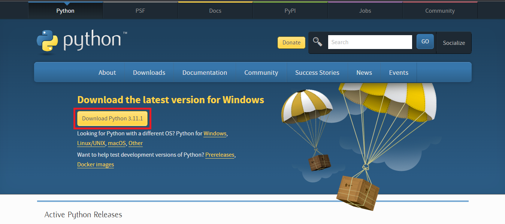

3. Después de que se haya descargado el archivo de instalación, dirijirse al explorador de archivos y buscar el ejecutable que se ha descargado (normalmente se almacena en *descargas*), después de que lo encuentre le dara doble clic al archivo.

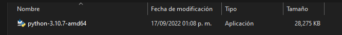  

### CONFIGURACIÓN
#### **ENTORNO (SISTEMA OPERATIVO)**
4. Ahora aparecerá la siguiente ventana. Usted necesita agregar una variable de entorno, para que el sistema operativo, al revisar sus opciones pueda encontrar los archivos de Python para poder ejecutar sus programas, para ello debe seleccionar la siguiente casilla:

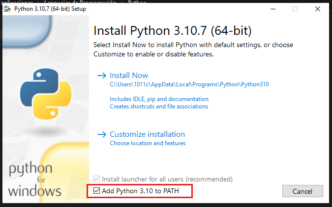

5. Posteriormente a marcar la casilla, lo unico que se debe hacer es dar clic en *Install Now*.

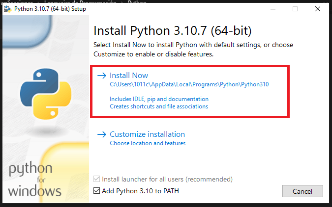  

6. Por ultimo debe esperar a que termine la instalación y dar clic en *close*.    

Para revisar que se haya instalado correctamente, presionamos las teclas **Ctrl** y **R** al mismo tiempo. Nos mostrara la siguiente ventana:

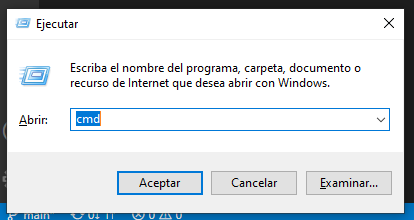  

Cuando aparezca, tenemos que escribir **cmd** como en la imágen anterior, y damos enter.
Estando en el **CMD** (que es la aplicación que se acaba de ejecutar) escribiremos lo siguiente:  
```
> python --version
```
Y damos enter, debería aparecernos lo siguiente:

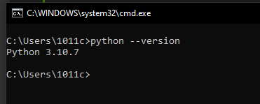

#### **ENTORNO (EDITOR DE TEXTO)**
Para poder usar el lenguaje de programación, necesita usar un editor de texto, algunos editores de texto recomendados son mencionados en este proyecto (Sublime Text, Atom o VSCode), en este caso se hara uso de VSCode. Es recomendable usar una extensión de Python para este editor de texto pues gracias a esto se tiene una gran variedad de herramientas para poder utilizar. Para poder instalar una extensión se hace lo siguiente:  
1. Primero se ejecuta VSCode.

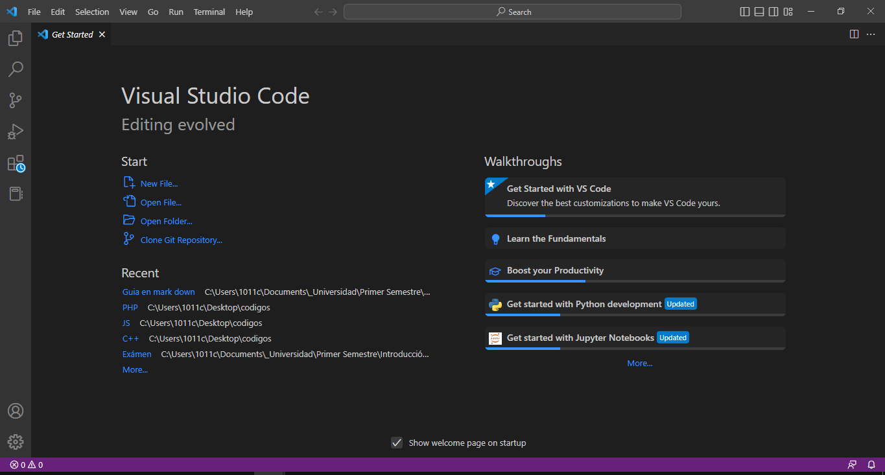  

2. Posterior a eso se debe de seleccionar el apartado de extensiones:

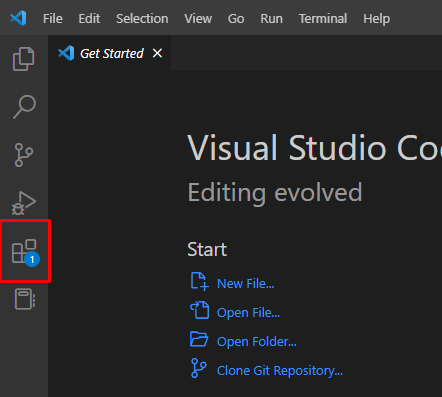  

3. Después, aparece un apartado donde se pueden hacer busquedas, ahi colocaremos **Python**.

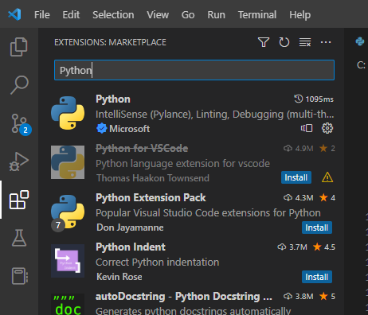  

4. Por ultimo seleccionamos la primer opción que nos aparece y daremos clic en **install**.  

  

Listo, con esos sencillos pasos se habra instalado una extensión en VSCode para Python.  

## COMENZAR CON LA PROGRAMACÍON EN PYTHON
Típicamente, cuando se va a iniciar con el uso de un lenguaje de programación lo primero que se hace es escribir un ***"Hola mundo"***. Nosotros para no romper la costumbre, haremos lo mismo... Pero primero debemos hacer lo siguiente:

1. En la carpeta ***codigos*** que creamos, tenemos que crear una carpeta que lleve por nombre ***Python***.

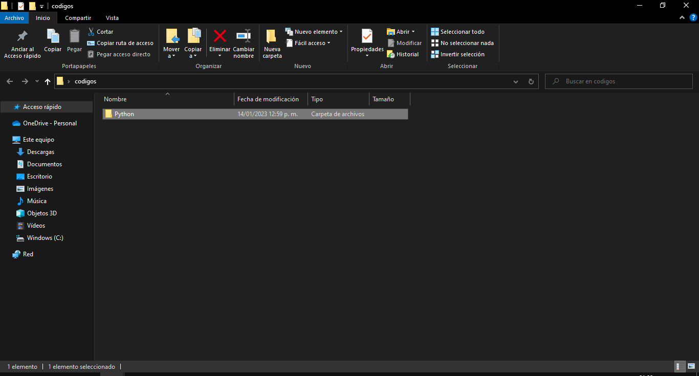

2. Ahora nos dirigiremos a VSCode, en el apartado de ***File*** seleccionamos ***open folder***.

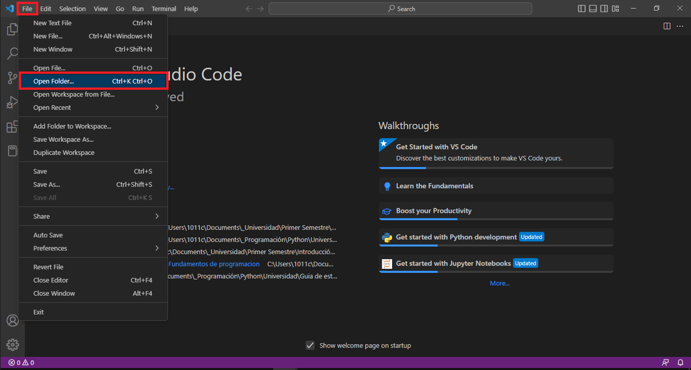

3. Nos mostrar una ventana para seleccionar cual carpeta queremos abrir. Estando en esa ventana, tenemos que elegir primero ***Escritorio*** y nos debe aparecer la carpeta que creamos que lleva por nombre ***codigos***, le damos doble clic a la carpeta para abrirla.

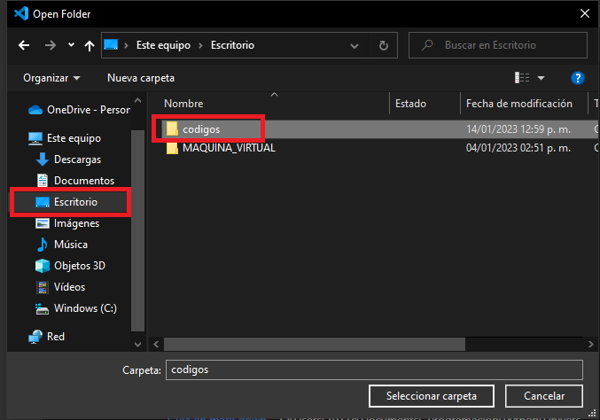

4. Dentro de la carpeta debe de estar la carpeta ***Python*** que creamos, la seleccionamos, tenemos que revisar en la parte inferior que este el nombre de la carpeta y damos clic en ***Seleccionar carpeta***.

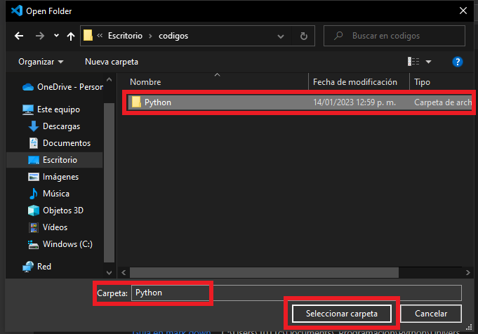

5. Nos aparecera el siguiente aviso, tenemos que darle clic en ***Yes, I trust the authors***.

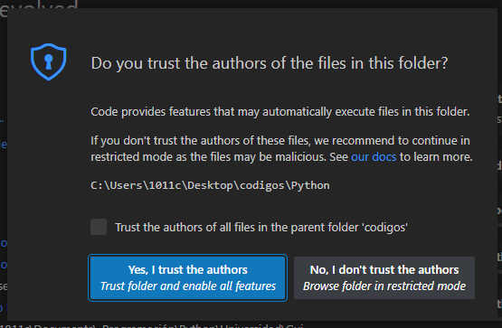

6. Una vez dando clic en el mensaje, nos debe de aparecer en el apartado superior izquierdo el nombre de la carpeta ***Python***. Si no aparece la carpeta, vuelvalo a realizar a partir de paso 2.

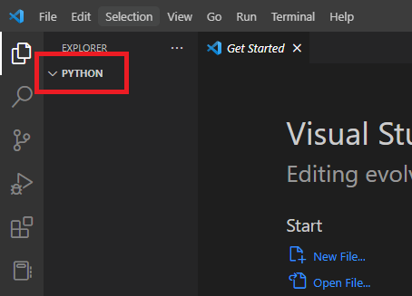

7. Para crear un nuevo archivo se necesita posicionar el cursor sobre el nombre de la carpeta ***Python***, apareceran varias opciones, seleccionamos el que dice ***New file***:

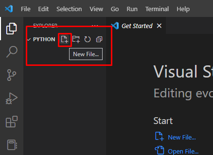

### HOLA MUNDO 
Para imprimir en pantalla un mensaje que diga ***Hola mundo***, haremos lo siguiente:

1. Crearemos un nuevo archivo en la carpeta de ***Python*** que hemos abierto recientemente y colocaremos ***el nombre del archivo*** con la extensión de Python que es ***.py*** (cada que se cree un programa en Python se deben especificar estos elementos) además, el nombre no puede contener espacios, se deben sustituir los espacios por guiones bajos. En este caso nombraremos al archivo como: ***hola_mundo.py*** y daremos enter para que se cree.


2. Aparecerá de la siguiente manera, y en la parte señalada es el apartado donde se escribirá el codigo del programa:

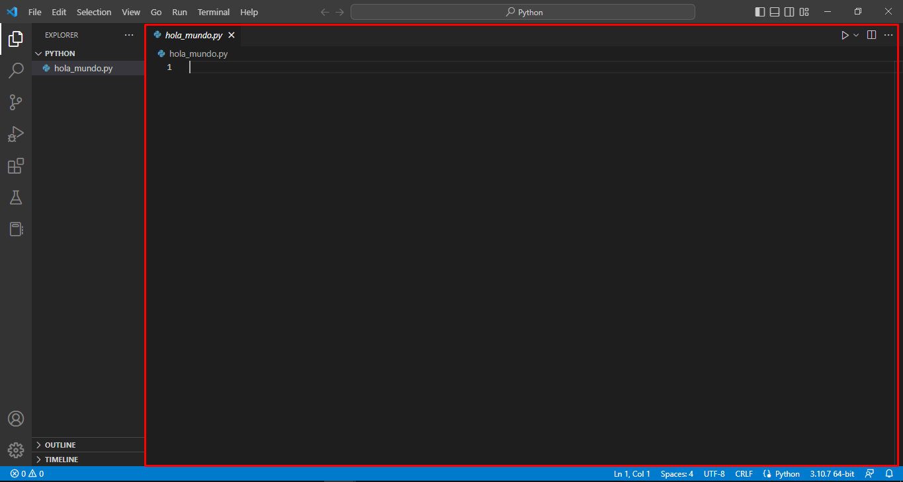

3. Ahora procederemos a escribir el codigo para poder imprimir un ***"Hola mundo"*** en pantalla:

```Python
print("Hola mundo")
```

4. Cuando terminamos de escribir el código, necesitamos guardarlo, en la parte superior, donde esta el nombre del archivo, vemos que tiene un punto blanco, eso significa que necesita guardarse.

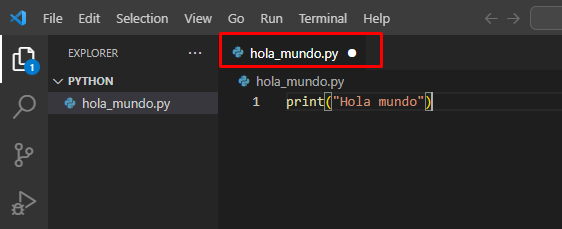

5. Para poder guardarlo únicamente debemos de presionar las teclas **Ctrl** y **S** al mismo tiempo. Despues podra notar que el punto blanco ha desaparecido, lo que significa que se ha guardado el archivo.  

> NOTA: La funcion `print()` lo que hace es mostrar en pantalla un mensaje, el cual es especificado entre los parentesis.

### COMANDOS DE EJECUCIÓN DE UN PROGRAMA
Para que podamos ejecutar el programa necesitamos usar la terminal de Windows y unos comandos, solo sigue los siguientes pasos:

1. Presiona las teclas **Ctrl** y **R** al mismo tiempo, en la ventana que aparezca, escribe ***cmd*** y da clic en ***aceptar***.


2. Al ejecutarlo nos aparecera lo siguiente, eso es la terminal de Windows: 

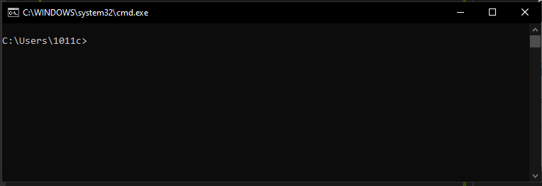

> NOTA: Los siguientes comandos son los que se van a estar utilizando durante la guía, es necesario que se los aprenda.

3. Para ver cuales son las carpetas que se encuentran en una ubicación se utiliza el comando:
```
> dir
```

4. Necesitamos escribir el comando y dar enter, lo que tenemos que buscar que nos aparezca es la carpeta **Desktop** o **Escritorio** dependiendo del idioma de su ordenador.

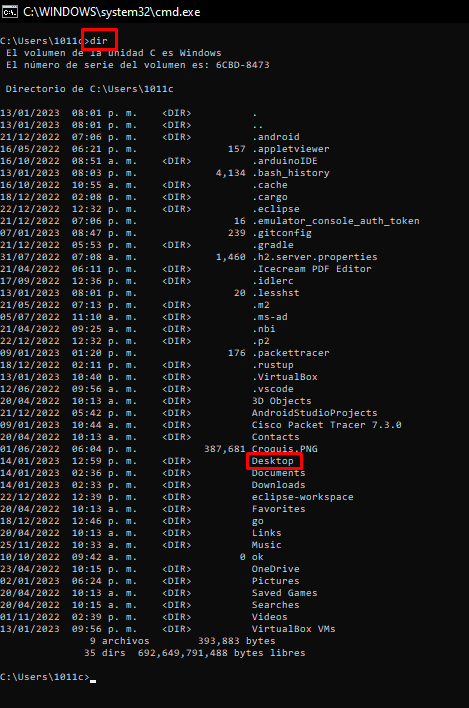

5. Al encontrarlo, tenemos que seleccionarlo y abrirlo, para poder hacer eso se usa el comando:
```
> cd "nombre de la carpeta"
```

6. Colocamos el comando y el nombre de la carpeta, en este caso es **"Desktop"**, al dar enter debemos notar que en la ultima linea aparecera una diagonal inversa y posterior el nombre de la carpeta que habíamos especificado:

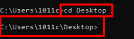

7. Después de eso usaremos nuevamente el comando **dir** para verificar las el contenido de la carpeta que elegimos, tenemos que encontrar que esta la carpeta **codigos** en su interior:

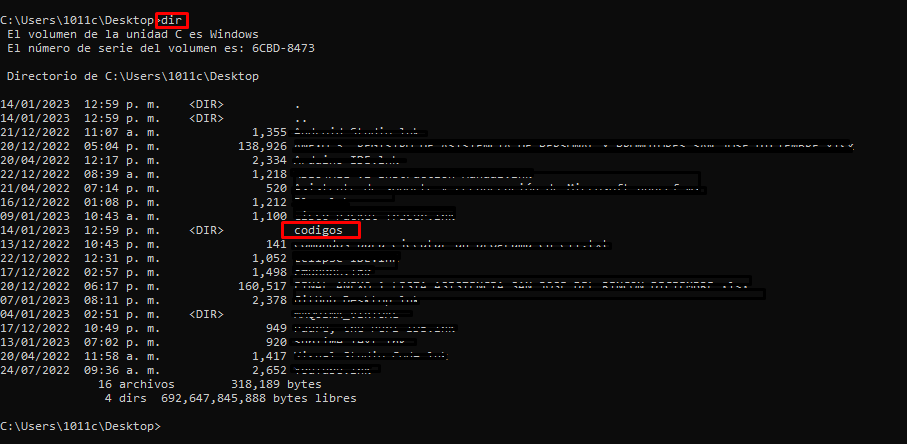

8. Al encontrar la carpeta, usaremos el comando **cd** para ingresar en ella, de igual manera, al dar enter nos debe de aparecer en la ultima linea de texto una diagonal inversa seguido el nombre de la carpeta que espeficicamos.

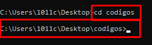

9. Ahora necesitamos verificar el contenido de la carpeta con **dir**, tenemos que encontrar la carpeta Python.

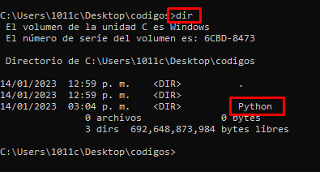

10. Al encontrarla, la seleccionaremos con **cd**.

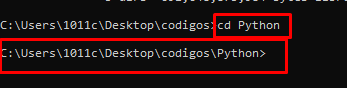

11. Necesitamos buscar el archivo que creamos donde esta el mensaje de Python, usaremos nuevamente el comando **dir** y veremos si se encuentra el archivo.

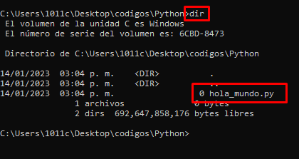

12. Al encontrarlo, necesitamos ejecutarlo, esto se hace con el siguiente comando:
```
> python "nombre_del_archivo".py
```

13. El comando solo se usa para ejecutar los archivos escritos en Python, en este caso, para ejecutar el archivo escribiremos **python hola_mundo.py** y damos enter, en seguida se ejecutara el programa:

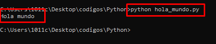

14. Despues del enter nos daremos cuenta de que el mensaje que escribimos para que se imprimiera en pantalla lo ha hecho.

Esto es lo que se necesita hacer para poder crear un programa en Python y poder ejecutarlo.  

---
Otro comando que le será útil al momento de usar la terminal de Windows para ejecutar programas de Python o de algún otro lenguaje de programación es el siguiente, lo que hace es permitirle salir de una carpeta:
```
> cd ..
```
Al presionar las teclas **Ctrl** y **C** al mismo tiempo, le ayuda a detener una ejecución.  

Para no tener que escribir nuevamente un comando que ya habia escrito puede usar las teclas de dirección que apuntan hacia arriba o hacia abajo para poder ver los comandos anteriores que habia escrito.

Para acompletar un nombre largo de una carpeta o archivo, puede escribir las primeras letras del nombre de la carpeta o archivo y presionar tabulación, este le acompletará el resto del nombre.


> ### NOTA: ES muy importante que se aprenda los pasos para la creación de un archivo para Python y los pasos para ejecutar un programa, así como los comandos a usar en la terminal de Windows, ya que serán los mismos que se estaran usando para los siguientes ejemplos de algoritmos escritos en Python.


### 10 ALGORITMOS DE EJEMPLO ESCRITOS EN PYTHON
***1. Suma de dos numeros enteros:** Lo que usted tiene que hacer es crear un programa en el cual se creen tres variables, a las dos primeras se les asignaran valores de enteros y la tercer variable va a hacer la suma de las dos variables anteriores.*  
Lo primero que debe hacer es crear un archivo que lleve por nombre Suma, en el usted escribirá el codigo siguiente y después lo guardará:
```Python
a = 5
b = 6
c = a + b

print("La suma es: ", c)
```
Ahora abrirá el **cmd** con los pasos que se le mostrarón al inicio, buscará la carpeta donde esta el archivo de Python, y lo ejecutara:
```
> python Suma.py
```
La salida será la siguiente:

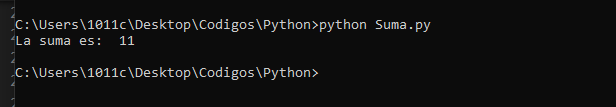

> NOTA: La funcion `print()` puede mostrar no solo texto, sino también numeros, sin embargo, para el texto se debe de especificar **entre comillas**, ya sean dobles o siples


***2. Solicitar nombre al usuario y mostrarlo:** Elaborará un programa que solicite el nombre de una persona y lo muestre.* 
Crear un archivo con extensión por ejemplo Pedir_nombre.py (puede ponerle también el nombre que usted desee) en el cual se debe de tener el siguiente contenido:
```Python
nombre = input("Por favor ingrese su nombre: ")
print(nombre)
```
Ahora ejecute el archivo:
```
> python Pedir_nombre.py
```
La salida será la siguiente: 

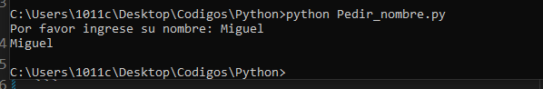

> NOTA: La funcion `input()` sirve para solicitar datos desde el teclado, entre los parentesis usted puede solicitar que se muestre un mensaje al momento de que el programa pida un dato, asi como la funcion `print()`


***3. Evaluar si una persona es mayor o menor de edad:** Usted creara un rograma que pregunte la edad de una persona y evalúe si es mayor o menor de edad, si tiene menos de 18 mostrará un mensaje de que es menor de edad, de lo contrario mostrar que es mayor de edad, pero si ingresa un valor que sea erroneo como un numero negativo debera mostrar un mensaje de error.*

El archivo que se va a crear se llamará Evaluar_edad.py y debe de tener lo siguiente:
```Python
edad = int(input("Ingrese su edad: "))

if edad > 0:
    if edad <= 17:
        print("Eres menor de edad")
    else: 
        print("Eres mayor de edad")
else:
    print("La edad no es correcta")
```
Se va a ejecutar en la terminal con el comando:
```
> python Evaluar_edad.py
```
El resultado será el siguiente:


> NOTA: En este ejercicio se ven varias cosas, la función `int()` sirve para convertir un mensaje (que esta como forma de texto) a un valor numérico, pero solo funciona con números, si se quiere convertir una palabra a número, nos mostrará un error. 

> La palabra `if` es usada para crear una condición, después de la palabra `if` va la condición y dos puntos `:` también se le puede colocar un `else` para que al momento de que no se cumpla una condición se pueda cumplir otra.


***4. Tablas de multiplicar:** El usuario ingresará un número y el programa realizará las tablas de multiplicar del 1 al 10.*

Crear el archivo Tablas.py con el siguiente contenido:
```Python
numero = int(input("Ingrese un número: "))

for a in range(1, 11):
    print(f"{numero} * {a} = {numero * a}")
```
Después de guardar el archivo, lo ejecutaremos en la terminal:
```Python
> python Tablas.py
```
La salida será la siguiente:

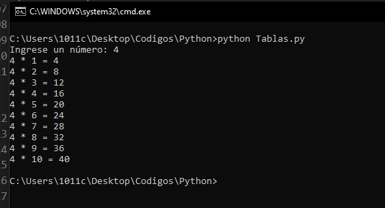

> NOTA: La palabra `for` es usada para especificar que se hara uso de una estructura repetitiva mejor conocida como bucle, seguido de una variable en la que se almacenaran los elementos individuales de una lista, en este caso se uso la variable `a` pero se puede poner el nombre que se quiera, después se usa la palabra `in` que hace referencia a que un elemento esta en la lista y por ultimo se especifica la lista, en este caso para generar una lista de números usamos la funcion `range()` dicha función puede generarnos listas de numeros para poder hacer funcionar el bucle, sin embargo, entre los parentesis es necesario especificar la cantidad de elementos a considerar. La función `range()` puede funcionar solo con un parametro (un parametro es aquel valor que se le va a indicar a la función que va a usar y que se coloca entre los paréntesis) si solo se le coloca un parametro, la función lo tomara en cuenta para saber cuantos elementos numéricos generará, si se le colocan dos parámetros, la función tomará en cuenta al primero para saber desde que valor comenzar a generar la lista y el segundo parametro hasta cual valor dejará de generar la lista.

***5. Numeros impares:** El programa imprimira en pantalla 10 numeros impares.*
Elaborar un archivo con el nombre Impares.py, el cual debe contener:
```Python
for a in range(1, 20, 2):
    print(a)
```
Después debe ejecutar el archivo .py:
```
> python Impares.py
```
El programa generará la siguiente salida:

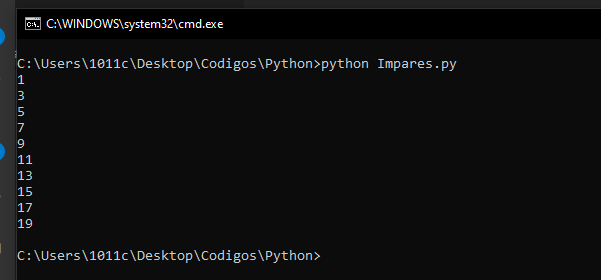

> NOTA: Ahora estamos usando a la función `range()` con tres parámetros, ya se explicó para que funcionan los otros dos, entoces, el tercer parámetro funciona para indicarle a la función de cuanto en cuánto generará la lista numérica.


***6. División, dos decimales:** Hacer un programa que pueda hacer una división y que el resultado únicamente permita dos decimales.*
En el archivo Div_Dec.py que creará colocar lo siguiente:
```Python
numero_uno = 10
numero_dos = 3
resultado = numero_uno / numero_dos

print(round(resultado, 2))
```
Ejecutar el archivo en la terminal.
```
> python Div_Dec.py
```
Se generará la siguiente salida:

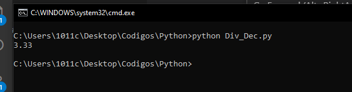

> NOTA: En Python, para hacer una división se hace uso del signo `/` para imprimir el resultado usaremos la función `print()` pero ahora, dentro de los parentesis usaremos la función `round()` la cual funciona para decidir cuantos decimales usar y redondearlos, dentro de los paréntesis se colocan dos parámetros, el primero será el valor con decimales, y en el segundo parámetro se especificaran los decimales que se quieren mostrar (los parametros son separados por una coma).


***7. División Entera:**  Ahora generará un programa que únicamente devuelva resultados enteros al momento de realizar una división.*
En el archivo Division_entera.py colocar el siguiente código:
```Python
numero_uno = 10
numero_dos = 3
resultado = numero_uno // numero_dos

print("El resultado es: ", resultado)
```
En la terminal de comandos colocar la instrucción para ejecutar el archivo de Python:
```
> python Division_entera.py
```
El código anterior dará como resultado lo siguiente:

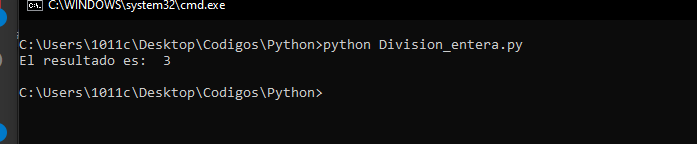

> NOTA: En Python, para hacer una división que solo genere resultados sin decimales, se hace uso de dos diagonales `//`


***8. Potencia:** Elaborar un programa que sea capaz de obtener la potencia de un número dado por el usuario.*
El archivo se llamará Potencia.py y contendrá lo siguiente:
```Python
base = int(input("Por favor ingrese un numero base: "))
exponente = int(input("Por favor, ahora ingrese el exponente: "))

print(f"El resultado de la potencia es: {base**exponente}")
```
Ejecutar el archivo .py:
```
> python Potencia.py
```
Lo anterior nos dará como resultado lo siguiente:

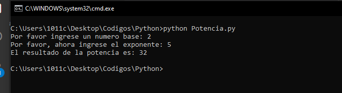

> NOTA: Algo de que tiene Python, es que puede imprimir mensajes de texto y al mismo tiempo un valor numérico o el resultado de una operación, para poder hacerlo se hace uso de algo conocido como ``f String`` dentro de los paréntesis del `print()` se coloca una `f` y en seguida, pegado a la `f` unas comillas "", dentro de las comillas se coloca el mensaje, y para hacer una operación o un valor numerico se coloca entre llaves {} 

> En Python, para hacer una operación de potencia se hace uso de dos asteriscos **


***9. Raíz Cuadrada o Cúbica:** El usuario tendrá las opciones de elegir entre una raíz cuadrada o cúbica, dichas operaciones seran programadas y el usuario podra dar el valor que quiera obtener su raíz cuadrada o cúbica.*
Crear el archivo Raiz.py y en el poner el siguiente código:
```Python
opcion = int(input("1. Realizar una raíz cuadrada. 2. Realizar una raíz cúbica. \n Elija su opción: "))
numero = int(input("Ingrese un número: "))

if opcion == 1:
    print("La raiz cuadrada es: ")
    print(numero ** .5)
elif opcion == 2:
    print("La raiz cubica es: ")
    print(numero ** .33)
else:
    print("Lo lamentamos, lo que solicito no esta disponible")
```
Después de guardar el archivo debe ejecutarlo:
```
> python Raiz.py
```
Lo anterior nos dará como salida lo siguiente:

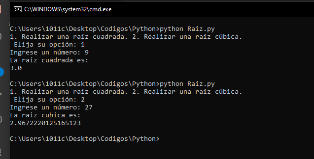

> NOTA: Cuando un texto es demasiado largo se pueden dar saltos de linea usando una diagonal inversa y la letra n `\n` 

> En una condición, si se van a evaluar varias cosas se hace uso del `elif` seguido de la condición y cerramos con dos puntos `:`

> Ahora para sacar una raíz lo que se hace es usar un número elevado a un número decimal.


***10. Invertir:** El usuario introducirá una palabra y el programa debe de invertir dicha palabra.* 
Se pueden proponer distintas soluciones, sin embargo una de ellas es la siguiente, primero se crea el archivo Invertir.py y en él se coloca el siguiente código:
```Python
palabra = input("Ingrese una palabra: ")
nueva_palabra = ""

for letra in palabra:
    nueva_palabra = letra + nueva_palabra

print(nueva_palabra)   
```
Ejecutar el archivo en la terminal de comandos:
```
> python Invertir.py
```
La salida generada deberá ser la siguiente:

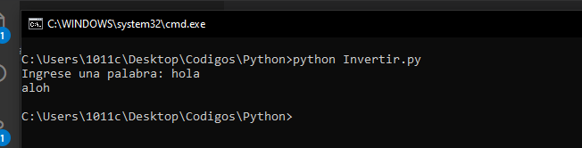

> NOTA: En programación el signo `+` no necesariamente significa que sirve para hacer sumas, en programación es usado para hacer algo llamado concatenación, lo que significa que une dos valores, en este caso, lo que hace el programa es unir un elemento antes del otro, de esta manera la palabra se invierte.


## C++
### ¿QUÉ ES C++?
C++ es un lenguaje de programación que proviene de la extensión del lenguaje C para que pudiese manipular objetos. A pesar de ser un lenguaje con muchos años, su gran potencia lo convierte en uno de los lenguajes de programación más demandados.

Fue diseñado a mediados de los años 80 por el danés Bjarne Stroustrup. Su intención fue la de extender el lenguaje de programación C (con mucho éxito en ese momento) para que tuviese los mecanismos necesarios para manipular objetos. 

### PARADIGMAS QUE SE PUEDEN IMPLEMENTAR
C++ contiene los paradigmas de la programación estructurada y orientada a objetos, por lo que se le conoce como un lenguaje de programación multiparadigma.

### APLICACIONES COMUNES DEL LENGUAJE
Se pueden construir Bases de Datos con C++.
Muchos navegadores web usan C++ debido a que el lenguaje tiene bastante potencia y es muy rápido en la ejecución.
Lo principal que se ha construido con C++ son los Sistemas Operativos, Windows, Linux, e incluso MacOS, su código principal esta escrito en C++.
Compiladores de muchos lenguajes de programación están escritos en C++.
C++ es utilizado aún en el mundo de los videojuegos, bien para programar motores gráficos o para alguna parte concreta del videojuego.
También tiene otras aplicaciones como en máquinas médicas, relojes inteligentes, etc. por su capacidad de estar cerca del lenguaje máquina que otros lenguajes de alto nivel.

### PROS Y CONTRAS VS OTROS LENGUAJES
Las principales ventajas de programar en C++ son:
Alto rendimiento: Es una de sus principales características, el alto rendimiento que ofrece. Esto es debido a que puede hacer llamadas directas al sistema operativo, es un lenguaje compilado para cada plataforma, posee gran variedad de parámetros de optimización y se integra de forma directa con el lenguaje ensamblador.
Lenguaje actualizado: A pesar de que ya tiene muchos años, el lenguaje se ha ido actualizando, permitiendo crear, relacionar y operar con datos complejos y ha implementado múltiples patrones de diseño.
Multiplataforma
Extendido: C y C++ están muy extendidos. Casi cualquier programa o sistema están escritos o tienen alguna parte escrita en estos lenguajes (desde un navegador web hasta el propio sistema operativo).
Las principales desventajas de C++ es que se trata de un lenguaje muy amplio (con muchos años y muchas líneas de código), tiene que tener una compilación por plataforma y su depuración se complica debido a los errores que surgen. Además el manejo de librerías es más complicado que otros lenguajes como Java o .Net y su curva de aprendizaje muy alta.

### INSTALACIÓN
1. Lo primero es descargar el programa que nos ayudará a poder usar c++, esto lo sacaremos de la siguiente página: [https://sourceforge.net/projects/mingw/](https://sourceforge.net/projects/mingw/ "Descargar minGW")


2. Ahora necesitamos ubicar el archivo descargado: 


3. Le damos clic derecho para que inicie con la instalación: 


3. Ahora solo necesita dar clic en **Next** en las ventanas que le aparezcan:


4. Solo necesita dar clic en finalizar para terminar la instalación.


### CONFIGURACIÓN
#### **ENTORNO (SISTEMA OPERATIVO)**
5. Ahora necesitamos configurar el sistema. Necesitamos ubicar la carpeta de MinGW, esta en Windows:


6. Ahora seleccionamos la carpeta **mingw64** 


7. Después de eso seleccionamos la carpeta **bin** y lo abrimos


8. Ahora, necesitamos copiar la ruta actual: 


9. Después de eso tenemos que dirigirnos a configuración, en **Sistema**, seleccionamos **Acerca de**


10. Y ubicamos el apartado de configuración avanzada del sistema:


11. Nos aparecera la siguiente ventana y seleccionamos **Variables de entorno...**


12. Ahora ubicaremos el apartado de **Path**, lo seleccionamos y damos clic en **Editar**


13. Nos aparecerá lo siguiente y daremos clic en **Nuevo**


14. Nos dara la opción de agregar una nueva variable, ahí pegaremos la ruta que copiamos y damos clic en **Aceptar**.  


15. En la otra ventana damos clic en **Aceptar**.


16. En la otra también damos clic en **Aceptar** y listo, ya tendremos configurado **C++** para usar.


#### **ENTORNO (EDITOR DE TEXTO)**
Para poder usar el lenguaje de programación, necesita usar un editor de texto, algunos editores de texto recomendados son mencionados en este proyecto (Sublime Text, Atom o VSCode), en este caso se hara uso de VSCode. Es recomendable usar una extensión de C++ para este editor de texto pues gracias a esto se tiene una gran variedad de herramientas para poder utilizar. Para poder instalar una extensión se hace lo siguiente:  
1. Primero se ejecuta VSCode.

  

2. Posterior a eso se debe de seleccionar el apartado de extensiones:

  

3. Después, aparece un apartado donde se pueden hacer busquedas, ahi colocaremos **C++**.

  

4. Por ultimo seleccionamos la primer opción que nos aparece y daremos clic en **install**.  

  

Listo, con esos sencillos pasos se habra instalado una extensión en VSCode para C++.  

### COMENZAR CON LA PROGRAMACIÓN EN C++
Como primer programa debemos crear el típico "Hola mundo".
Debemos seguir los siguientes pasos para lograrlo:

1. En la carpeta ***codigos*** que creamos, tenemos que crear una carpeta que lleve por nombre ***C++***.


2. Ahora nos dirigiremos a VSCode, en el apartado de ***File*** seleccionamos ***open folder***.


3. Nos mostrar una ventana para seleccionar cual carpeta queremos abrir. Estando en esa ventana, tenemos que elegir primero ***Escritorio*** y nos debe aparecer la carpeta que creamos que lleva por nombre ***codigos***, le damos doble clic a la carpeta para abrirla.


4. Dentro de la carpeta debe de estar la carpeta ***C++*** que creamos, la seleccionamos, tenemos que revisar en la parte inferior que este el nombre de la carpeta y damos clic en ***Seleccionar carpeta***.


5. Nos aparecera el siguiente aviso, tenemos que darle clic en ***Yes, I trust the authors***.


6. Una vez dando clic en el mensaje, nos debe de aparecer en el apartado superior izquierdo el nombre de la carpeta ***C++***. Si no aparece la carpeta, vuelvalo a realizar a partir de paso 2.


7. Para crear un nuevo archivo se necesita posicionar el cursor sobre el nombre de la carpeta ***C++***, apareceran varias opciones, seleccionamos el que dice ***New file***:

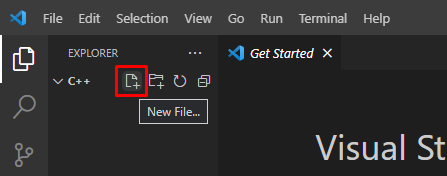

### HOLA MUNDO 
Para imprimir en pantalla un mensaje que diga ***Hola mundo***, haremos lo siguiente:

1. Crearemos un nuevo archivo en la carpeta de ***C++*** que hemos abierto recientemente y colocaremos ***el nombre del archivo*** con la extensión de C++ que es ***.cpp*** (cada que se cree un programa en C++ se deben especificar estos elementos) además, el nombre no puede contener espacios, se deben sustituir los espacios por guiones bajos. En este caso nombraremos al archivo como: ***hola_mundo.cpp*** y daremos enter para que se cree.


2. Aparecerá de la siguiente manera, y en la parte señalada es el apartado donde se escribirá el codigo del programa:


En el codigo pondremos lo siguiente:
```C++
#include<iostream>

using namespace std;

int main(){

    cout<<"Hola mundo";

    return 0;

}

```

4. Cuando terminamos de escribir el código, necesitamos guardarlo, en la parte superior, donde esta el nombre del archivo, vemos que tiene un punto blanco, eso significa que necesita guardarse.


5. Para poder guardarlo únicamente debemos de presionar las teclas **Ctrl** y **S** al mismo tiempo. Despues podra notar que el punto blanco ha desaparecido, lo que significa que se ha guardado el archivo.  

> NOTA: Para hacer impresiones en pantalla siempre se debe de usar: <br> `#include<iostream>` esta linea de codigo funciona para hacer referencia a que se van a hacer entradas y salidas de datos. <br>
`using namespace std;` es necesario especificarlo al inicio, de lo contrario deberá especificarse en cada impresión en pantalla. <br>
`int main(){}` es la funcion principal, todo el código va dentro de las llaves. <br>
`cout<<"";` esta linea de código nos permite hacer las impresiones en pantalla.
`return 0;` esta línea de código le indica al programa que ha finalizado. <br>
Como habrás notado, al finalizar cada línea de codigo es necesario poner un `;` <br>
Además de que cada llave que se abre se debe cerrar. `{}`


### EJECUCIÓN DE UN PROGRAMA
Para que podamos ejecutar el programa necesitamos usar la terminal de Windows y unos comandos, solo sigue los siguientes pasos:

1. Presiona las teclas **Ctrl** y **R** al mismo tiempo, en la ventana que aparezca, escribe ***cmd*** y da clic en ***aceptar***.


2. Al ejecutarlo nos aparecera lo siguiente, eso es la terminal de Windows: 


> NOTA: Los siguientes comandos son los que se van a estar utilizando durante la guía, es necesario que se los aprenda.

3. Para ver cuales son las carpetas que se encuentran en una ubicación se utiliza el comando:
```
> dir
```

4. Necesitamos escribir el comando y dar enter, lo que tenemos que buscar que nos aparezca es la carpeta **Desktop** o **Escritorio** dependiendo del idioma de su ordenador.


5. Al encontrarlo, tenemos que seleccionarlo y abrirlo, para poder hacer eso se usa el comando:
```
> cd "nombre de la carpeta"
```

6. Colocamos el comando y el nombre de la carpeta, en este caso es **"Desktop"**, al dar enter debemos notar que en la ultima linea aparecera una diagonal inversa y posterior el nombre de la carpeta que habíamos especificado:


7. Después de eso usaremos nuevamente el comando **dir** para verificar las el contenido de la carpeta que elegimos, tenemos que encontrar que esta la carpeta **codigos** en su interior:


8. Al encontrar la carpeta, usaremos el comando **cd** para ingresar en ella, de igual manera, al dar enter nos debe de aparecer en la ultima linea de texto una diagonal inversa seguido el nombre de la carpeta que espeficicamos.


9. Ahora necesitamos verificar el contenido de la carpeta con **dir**, tenemos que encontrar la carpeta C++.


10. Al encontrarla, la seleccionaremos con **cd**.


11. Necesitamos buscar el archivo que creamos donde esta el mensaje de Python, usaremos nuevamente el comando **dir** y veremos si se encuentra el archivo.


#### **COMPILACIÓN DE UN PROGRAMA**
12. Al encontrarlo, primero necesitamos compilarlo, esto se hace con el siguiente comando:

```
> g++ -c "nombre del archivo".cpp -o "nombre del archivo".o
```

13. El comando solo se usa para compilar los archivos escritos en C++, en este caso, para ejecutar el archivo escribiremos **g++ -c hola_mundo.cpp -o hola_mundo.o** y damos enter:

14. Nos debería de dar como salida lo siguiente, permitiendonos escribir el siguiente comando:


15. En seguida debemos de ejecutar el siguiente comando para realizar la compilación:

```
> g++ "nombre del archivo".o -o "nombre del archivo".exe
```

16. En este caso el comando tendría que decir **g++ hola_mundo.o -o hola_mundo.exe** y damos enter, ya se habra compilado el programa, si de casualidad da un mensaje de error, tendremos que revisar que el código esté bien escrito e intentaremos compilarlo nuevamente, si funciona correctamente debería de darnos la siguiente salida, nuevamente permitiendonos escribir el siguiente comando.


#### **EJECUCIÓN DE UN PROGRAMA**
17. Despues del enter y que no nos aparezca ningún error, procederemos a ejecutar el programa con el siguiente comando.

```
> "nombre del archivo".exe
```

18. En este caso se debe colocar **hola_mundo.exe** para ejecutar nuestro "Hola mundo" por lo que nos debería aparecer de la siguiente manera.


---
Otro comando que le será útil al momento de usar la terminal de Windows para ejecutar programas de Python o de algún otro lenguaje de programación es el siguiente, lo que hace es permitirle salir de una carpeta:
```
> cd ..
```
Al presionar las teclas **Ctrl** y **C** al mismo tiempo, le ayuda a detener una ejecución.  

Para no tener que escribir nuevamente un comando que ya habia escrito puede usar las teclas de dirección que apuntan hacia arriba o hacia abajo para poder ver los comandos anteriores que habia escrito.

Para acompletar un nombre largo de una carpeta o archivo, puede escribir las primeras letras del nombre de la carpeta o archivo y presionar tabulación, este le acompletará el resto del nombre.


> ### NOTA: ES muy importante que se aprenda los pasos para la creación de un archivo para C++ y los pasos para ejecutar un programa, así como los comandos a usar en la terminal de Windows, ya que serán los mismos que se estaran usando para los siguientes ejemplos de algoritmos escritos en C++.

### 10 ALGORITMOS DE EJEMPLO ESCRITOS EN C++
***1. Suma:** Genere un programa que sea capaz de realizar una suma, se crearán dos variables con un valor entero asignado, después, con una tercer variable, se almacenará la suma de las dos primeras variables, y esta es la que se imprimirá en pantalla.*  

Primero tenemos que hacer los pasos para la creación de un archivo para C++, en este caso lo llamaremos **suma.cpp** y en él escribiremos lo siguiente:
```C++
#include<iostream>

using namespace std;

int main(){
    int primer_valor = 15;
    int segundo_valor = 5;

    int suma = primer_valor + segundo_valor;

    cout<<suma;

    return 0;
}
```

Después de guardar el archivo tenemos que compilarlo y ejecutarlo, así que tenemos que abrir la terminal de Windows, ubicar la carpeta donde este el archivo y escribir los siguientes comandos: 

```
> g++ -c suma.cpp -o suma.o 
```

Damos enter y escribimos el siguiente comando:

```
> g++ suma.o -o suma.exe
```

Damos enter y ejecutamos el programa con el siguiente comando:
```
> suma.exe
```

Al dar enter, nos debería de generar la siguiente salida:


> NOTA: Al igual que en otros lenguajes de programación, existen diferentes tipos de datos, sin embargo, para usar un dato en `C++` es necesario especificar que tipo de dato se va a utilizar, en este caso hacemos uso de un tipo de dato entero y una variable, a la cual se le asigna un valor: <br>
Entonces, debemos especificar un tipo de dato entero con la palabra reservada `int` <br>
Para crear una variable es necesario especificar el tipo de dato y darle un nombre a esa variable, puede ser el nombre que sea, en este caso nosotros la nombramos como `suma`, `primer_valor` y `segundo_valor`. <br>
Y para hacer una asignacion es necesario colocar un signo `=`

***2. Solicitar una palabra al usuario y mostrarla:** Debemos pedir al usuario que introdusca una palabra desde el teclado, después el programa mostrará la palabra que se introdujo.*

Primero crearemos el archivo al cual llamaremos **solicitar_nombre.cpp** y en él colocaremos el siguiente código:

```C++
#include <iostream>

using namespace std;

int main(){

    string palabra = "";

    cout<<"Por favor ingrese una palabra: ";
    cin>>palabra;

    cout<<"\n La palabra que digito es: " + palabra;

    return 0;
}
```

Después lo guardaremos y escribiremos los comandos para compilarlo y después ejecutarlo:

```
> g++ -c solicitar_nombre.cpp -o solicitar_nombre.o
```
```
> g++ solicitar_nombre.o -o solicitar_nombre.exe
```
```
> solicitar_nombre.exe
```

Al dar el último enter, tenemos que visualizar que nos aparecerá lo siguiente:


> NOTA: En este programa se hizo uso de un tipo de dato `string` esto nos permite crear una variable donde se podrán almacenar cadenas de texto, para la entrada de datos se uso `cin>>` seguido de la variable donde se almacenará lo que el usuario introduciría, y por último se uso un `\n` dentro del texto, esto nos permite hacer saltos de línea.

***3. Programa que calcule el IVA:** Deberá crear un programa que pida al usuario el valor de un precio, y depues el programa le agregará el IVA, tomando en cuenta que el IVA es de 16%. Por ultimo el programá deberá de mostrar el valor inicial y el valor final.*

Crear el archivo para C++ llamado en este caso **iva.cpp** y en él escribir el siguiente código:

```C++
#include <iostream>

using namespace std;

int main(){

    int valor_inicial;
    float valor_final;

    cout<<"\n ESTE PROGRAMA CALCULARA EL IVA CON RESPECTO AL PRECIO DE UN PRODUCTO";
    cout<<"\n\n Ingrese el precio de un producto: "; cin>>valor_inicial;

    cout<<"\n El precio inicial del producto es: "; cout<<valor_inicial;

    valor_final = valor_inicial + (16 * (valor_inicial / 100));

    cout<<"\n\n El precio final del producto es: "; cout<<valor_final;

    cout<<"\n";

    return 0;
    
}
```

Después de que se guarde el programa, se debe de compilar y despues se debe de ejecutar con los siguientes comandos:

```
> g++ -c iva.cpp -o iva.o
```
```
> g++ iva.o -o iva.exe
```
```
> iva.exe
```

Después de dar el último enter, nos debe de aparecer de la siguiente manera: 


> NOTA: En este caso, estamos haciendo uso de un tipo de dato que acepta decimales, el cual es `float` <br>
Para poder hacer la operación, como son varias operaciones, es necesario aplicar las leyes de los signos, colocando primero entre paréntesis que se va a hacer una division, despues se hace una multiplicacion, y al final se realiza la suma, para tener el resultado esperado.  

***4. Division con decimales especificados:** El programa hara una división, los valores ya estaran especificados en el programa, sin embargo, se deben especificar que el resultado de la operacion debe permitir como máximo 2 decimales, además de que los redondeará.*

Creará el archivo que lleve por nombre **division.cpp** y dentro colocara el siguiente código

```C++
#include <iostream>

using namespace std;

int main(){

    int valor1 = 10, valor2 = 3;
    float resultado;

    resultado = valor1 / valor2;

    cout.precision(2);
    cout<<"El resultado es: "; cout<<resultado <<endl;

    return 0;
}
```

Posterior a guardar el archivo necesitamos compilarlo y ejecutarlo, con los siguientes comandos:

```
> g++ -c division.cpp -o division.o
```
```
> g++ division.o -o division.exe
```
```
> division.exe
```

Lo anterior nos debería dar como resultado lo siguiente:


> NOTA: En este programa estamos haciendo uso de la funcion `cout.precision()` el cual nos permite especificar cual es la cantidad de decimales que mostrará, además de que hara un redondeo <br>
Otra función que vemos es `<<endl` esta funcion hace que se haga un salto de línea.

***5. Intercambio de valores:** Usted debe de generar un programa que solicite al usuario introducir dos valores desde teclado, cada uno se almacenará en una variable correspondiente, pero el programa despues intercambiará estos valores.*

Crear el archivo para C++ que en este caso se llamará **intercambiar.cpp**, dentro escribiremos:

```C++
#include <iostream>

using namespace std;

int main(){

    int primero, segundo, auxiliar;

    cout<<"Por favor ingrese el primer valor: "; cin>>primero;
    cout<<"Por favor ingrese el segundo valor: "; cin>>segundo;
    
    auxiliar = primero;
    primero = segundo;
    segundo = auxiliar;

    cout<<"El primer valor ahora es: "; cout<<primero <<endl;
    cout<<"El segundo valor ahora es: "; cout<<segundo <<endl;

    return 0;
}
```

Despues de guardar el archivo, usted necesita compilarlo y después ejecutarlo:

```
> g++ -c intercambiar.cpp -o intercambiar.o
```
```
> g++ intercambiar.o -o intercambiar.exe
```
```
> intercambiar.exe
```

Al final nos debería de dar la siguiente salida: 


> NOTA: Para poder hacer el intercambio de los valore que se poseian se requirio del uso de una tercer variable, primero se le asigno el primer valor a la variable auxiliar, despues a la primer variable se le asigno el segundo valor, y por ultimo a la segunda variable se le asigna el valor de la variable auxiliar.

***6. Area de un triángulo:** Usted necesita hacer un programa en el que un usuario ingrese la base y altura de un triángulo para que el program puede hacer la opercación correspondite para encontrar el área de dicho triángulo. Toma en cuenta que la formula para el área es:*  **(b * h) / 2**

Cree el archivo que se llamará **triangulo.cpp**, dentro escribirá lo siguiente:

```C++
#include <iostream>

using namespace std;

int main(){

    int base, altura;
    float resultado;

    cout<<"\n Ingrese la altura del triangulo: "; cin>>altura;
    cout<<"Ingrese la base del triangulo: "; cin>>base;

    resultado = (base * altura) / 2;

    cout<<"La base del triangulo es: "; cout<<resultado <<endl;

    return 0;
}
```

Al finalizar, como siempre debera de guardar antes de ejecutar el archivo:

```
> g++ -c triangulo.cpp -o triangulo.o
```
```
> g++ triangulo.o -o triangulo.exe
```
```
> triangulo.exe
```

Nos deberá de dar la siguiente salida:


> NOTA: Para poder hacer que funcione el programa requerimos de conocer como es que se introduce un texto desde teclado, como se muestra, los tipos de datos y operaciones, todos estos conocimientos ya se han mostrado como usar en los ejercicios anteriores, si tienes alguna duda, puedes volver a las explicaciones de los ejercicios anteriores.

***7. Promedio:** Elaborar un ejercicio que evalue las calificaciones de un alumno, estas seran ingresadas por el usuario, las sume y promedie, despues mostrará un mensaje al usuario, si tiene menos de 70 dira que reprobo, si tiene entre 70 y 85 dira que se fue a final, y si tiene mas de 85, dira que aprobó.*

Primero crear el archivo, se llamara **promedio.cpp** y dentro ira el siguiente codigo:

```C++
#include <iostream>

using namespace std;

int main(){

    int calificacion1, calificacion2, calificacion3;
    float resultado;

    cout<<"Ingrese tres calificaciones para saber cual es su estatus: \n";cin>>calificacion1; cin>>calificacion2; cin>>calificacion3;

    resultado = (calificacion1 + calificacion2 + calificacion3) / 3;

    cout<<"Su calificicacion es: "; cout<<resultado <<endl;

    if (resultado < 70){
        cout<<"Usted reprobo" <<endl;
    } else if (resultado < 85){
        cout<<"Usted aprobo pero esta en final" <<endl;
    } else {
        cout<<"Felicidades, usted ha aprobado" <<endl;
    }

    return 0;
}
```

Al finalizar de escribir el codigo se necesita compilar y ejecutar el archivo.

```
> g++ -c promedio.cpp -o promedio.o 
```
```
> g++ promedio.o -o promedio.exe
```
```
> promedio.exe
```

Al final el resultado de hacer todo el codigo y ejecutarlo será lo siguiente:


> NOTA: En este caso se hacen uso de estructuras incondicionales, estas sirven para que el programa tenga la habilidad de tomar decisiones. Para ello se usan las palabras reservadas `if` para evaluar una condición y hacer algo en caso de que se cumpla y `else` para hacer otra acción en caso de que no se cumpla la condición.

***8. Numeros:** Usted hara un programa que tenga la habilidad de evaluar un numero que fue ingresado por el usuario, y después de ello deberá de mostrar en pantalla el nombre de los numeros.*

Creamos el archivo que se llamará **nombre_numero.cpp** y en el irá lo siguiente:

```C++
#include <iostream>

using namespace std;

int main(){

    int numero;

    cout<<"\n";
    cout<<"Ingrese un numero basico (0 - 9): "; cin>>numero;    

    switch(numero){
        case 1: cout<<"Uno" <<endl; break;
        case 2: cout<<"Dos" <<endl; break;
        case 3: cout<<"Tres" <<endl; break;
        case 4: cout<<"Cuatro" <<endl; break;
        case 5: cout<<"Cinco" <<endl; break;
        case 6: cout<<"Seis" <<endl; break;
        case 7: cout<<"Siete" <<endl; break;
        case 8: cout<<"Ocho" <<endl; break;
        case 9: cout<<"Nueve" <<endl; break;
        case 0: cout<<"Cero" <<endl; break;
        default: cout<<"El numero que ingreso no esta en el rango especificado" <<endl; break;
    }

    return 0;
}
```

Despues de terminar de hacer los codigos y de haberlos guardado, procedemos a ejecutarlo:
```
> g++ -c nombre_numero.cpp -o nombre_numero.o
```
```
> g++ nombre_numero.o -o nombre_numero.exe
```
```
> nombre_numero.exe
```

Al terminar de ejecutar el archivo dara un resultado de: 


> NOTA: Para poder hacer varias evaluaciones se hace uso de otra estructura condicional que lleva por nombre `switch` y para evaluar hace uso de `case`, además de que al terminar una evaluación se debe de usar un `break` para indicar que la evaluación ha terminado.

***9. Valor mayor:** El usuario ingresará tres valores desde el teclado, usted debe de hacer que el programa evalue los tres valores y devuelva el valor que sea mayor.*

Para ello se debe de crear el archivo que lleve por nombre **mayor.cpp** y en él llevara lo siguiente:

```C++
#include <iostream>

using namespace std;

int main(){

    int uno, dos, tres;

    cout<<"\n Ingrese dos valores: "; cin>>uno; cin>>dos; cin>>tres;

    if (uno > dos && uno > tres){

        cout<<"El valor "; cout<<uno; cout<<" es el mayor" <<endl;

    } else if (dos > tres && dos > uno){

        cout<<"El valor "; cout<<dos; cout<<" es el mayor" <<endl;

    } else {

        cout<<"El valor "; cout<<tres; cout<<" es el mayor" <<endl;

    }

    return 0;
}
```

Al finalizar se debe de compilar y ejecutar.

```
> g++ -c mayor.cpp -o mayor.o
```
```
> g++ mayor.o -o mayor.exe
```
```
> mayor.exe
```

Esto nos debe de mostrar la siguiente salida:


> NOTA: Para poder hacer este ejercicio se hizo uso de un operador lógico que en este caso es `&&` esto significa `y` lo que quiere decir que se comprueban dos condiciones y ambas deben ser ciertas para poder ejecutarse, también vemos al final que en la terminal de Windows se ejecuta dos veces el programa, esto es solo como ejemplo para ver que el programa funcione correctamente, pero solo se ejecuta en el segundo intento el comando **mayor.exe**

***10. Elegir color:** El programa le mostrará al usuario una lista de colores, el usuario podra elegir un color, cuando lo elija el programa le mostrará un mensaje con el color que ha elegido.*

Crear primero el programa que llevara como nombre **colores.cpp** en el irá:

```C++
#include <iostream> 

using namespace std;

int main(){

    int color;

    cout<<"\n Usted puede elegir los siguientes colores \n 1.Azul \n 2.Amarillo \n 3.Verde \n 4.Negro \n 5.Rojo \n 6.Blanco \n";
    cin>> color;

    if (color == 1){
        cout<<"Azul";
    } else if (color == 2){
        cout<<"Amarillo";
    } else if (color == 3){
        cout<<"Verde";
    } else if (color == 4){
        cout<<"Negro";
    } else if (color == 5){
        cout<<"Rojo";
    } else if (color == 6){
        cout<<"Blanco";
    } else {
        cout<<"El color que eligio no esta disponible";
    }

    cout<<"\n";

    return 0;
}
```

Al finalizar de escribir el codigo y de haberlo guardado escribe los siguientes comandos:

```
> g++ -c colores.cpp -o colores.o
```
```
> g++ colores.o -o colores.exe
```
```
> colores.exe
```

Nos deberia de quedar de la siguiente manera:


> NOTA: Para este ejercicio estamos haciendo uso del signo `==` este signo nos sirve para comparar dos valores, ya que si solo se usa un signo `=` lo que estamos haciendo es asignar un valor.


## JAVASCRIPT
### ¿QUÉ ES JAVASCRIPT?
Para empezar, definamos que Java Script es un lenguaje de programación usado en el desarrollo web, es decir que se utilizar para las páginas web que solemos visitar en internet. Sin embargo, antes de decir más detalles del lenguaje, iniciemos diciendo como es la estructura de una página web.  
Una pagina web es construida con diversas herramientas, entre ellas, las más importantes son **HTML** el cual es usado para armar la estructura de la página, después se hace uso de **CSS** para darle diseño. Pero estos dos en conjunto solo son usados para diseñar la página que termina siendo una página web estática, es decir que únicamente nos mostrará información, y ahí es donde entra **Java Script**, él cual ayuda a darle funcionamiento a la página, lo que convertirá a la página web de estática a dinámica, es decir que los usuarios podrán interactuar con la página.   
Se anexa un ejemplo a continuación para una mejor comprensión:  

")

### PARADIGMAS QUE SE PUEDEN IMPLEMENTAR
Existe tres principales paradigmas de programación utilizados en la actualidad y que en JavaScript siempre han existido desde su primera versión.
Programación Estructurada
Programación Orientada a Objetos
Programación Funcional

### APLICACIONES COMUNES DEL LENGUAJE
JavaScript es un lenguaje de programación que los desarrolladores utilizan para hacer páginas web interactivas. Desde actualizar fuentes de redes sociales a mostrar animaciones y mapas interactivos, las funciones de JavaScript pueden mejorar la experiencia del usuario de un sitio web. Como lenguaje de scripting del lado del servidor, se trata de una de las principales tecnologías de la World Wide Web. Por ejemplo, al navegar por Internet, en cualquier momento en el que vea un carrusel de imágenes, un menú desplegable “click-to-show” (clic para mostrar), o cambien de manera dinámica los elementos de color en una página web, estará viendo los efectos de JavaScript.

### PROS Y CONTRAS VS OTROS LENGUAJES
#### **Ventajas de JavaScript**
**Velocidad:** JavaScript tiende a  ser muy rápido porque a menudo se ejecuta inmediatamente en el navegador. Entonces mientras no requiera recursos externos, JavaScript no tiene permitido retrasarse por llamados del servidor backend.
**Simplicidad:** La sintaxis de JavaScript está inspirada por Java y es relativamente sencillo de aprender comparado a otros lenguajes de programación populares como C++.
**Compatibilidad:** A diferencia de PHP u otros lenguajes scripting, JavaScript puede ser usado en cualquier página web. JavaScript puede ser usado en diferentes tipos de aplicaciones gracias al soporte en otros lenguajes como Pearl y PHP.
**Interfaces sencillas:** JavaScript puede ser usado para crear características como arrastrar y soltar, y componentes tales como las diapositivas, lo cual  mejora enormemente la interfaz de usuario y la experiencia del sitio.
**Funcionalidad extendida:** Los desarrolladores pueden extender la funcionalidad de las páginas web mediante fragmentos de JavaScript para un tercer grupo de extensiones como Greasemonkey.
**Versatilidad:** Hay muchos métodos para usar JavaScript mediante servidores Node.js.
**Actualizaciones:** Desde que la llegada de ECMAScript 5 (la especificación escrita en que se basa JavaScript), ECMA International se ha dedicado a actualizar JavaScript anualmente.  Hasta el momento, hemos recibido soporte para el navegador ES6 en 2017 y esperamos que ES7 sea soportado en un futuro.
#### **Desventajas de JavaScript**
**Seguridad Client-Side:** Desde que el código en JavaScript es ejecutado en el client-side, bugs y descuidos pueden ser explotados algunas veces para malos propósitos. Por esto, algunas personas deciden desactivar JavaScript por completo.
**Soporte del navegador:** Mientras server-side script siempre produce el mismo resultado, algunas veces diferentes navegadores interpretan el código JavaScript de manera distinta. Estos días  las diferencias son mínimas, y no deberías  tener que preocuparte mientras compruebes  tu código en la mayoría de los navegadores.  

### INSTALACIÓN
A diferencia de los demás lenguajes de programación, no se necesita instalar JavaScript en el ordenador, puesto a que este se ejecuta en los navegadores, lo que si se necesita hacer es encontrar la parte donde se puede visualizar los resultados de las ejecuciónes de un programa.  

### CONFIGURACIÓN
#### **ENTORNO (SISTEMA OPERATIVO)**
1. Primero se abre un navegador, puede ser el navegador de preferencia, en este caso usaremos Chrome de ejemplo:


2. Estando en el navegador, daremos clic derecho y seleccionamos **inspeccionar**


3. Posterior a eso nos aparecerá de la siguiente manera:


4. Ahora ubicaremos el apartado que dice **console** y lo abrimos


5. Nos aparecerá de la siguiente manera, ese es el apartado donde se va a mostrar los resultados de ejecución de los programas.


#### **ENTORNO (EDITOR DE TEXTO)**
Para poder usar el lenguaje de programación, necesita usar un editor de texto, algunos editores de texto recomendados son mencionados en este proyecto (Sublime Text, Atom o VSCode), en este caso se hara uso de VSCode. Es recomendable usar una extensión de JavaScript para este editor de texto pues gracias a esto se tiene una gran variedad de herramientas para poder utilizar. Para poder instalar una extensión se hace lo siguiente:  
1. Primero se ejecuta VSCode.

  

2. Posterior a eso se debe de seleccionar el apartado de extensiones:

  

3. Después, aparece un apartado donde se pueden hacer busquedas, ahi colocaremos **JavaScript**.

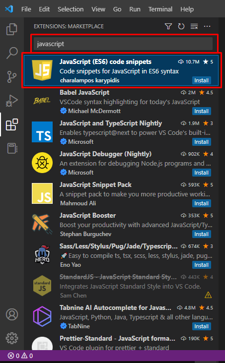  

4. Por ultimo seleccionamos la primer opción que nos aparece y daremos clic en **install**.  

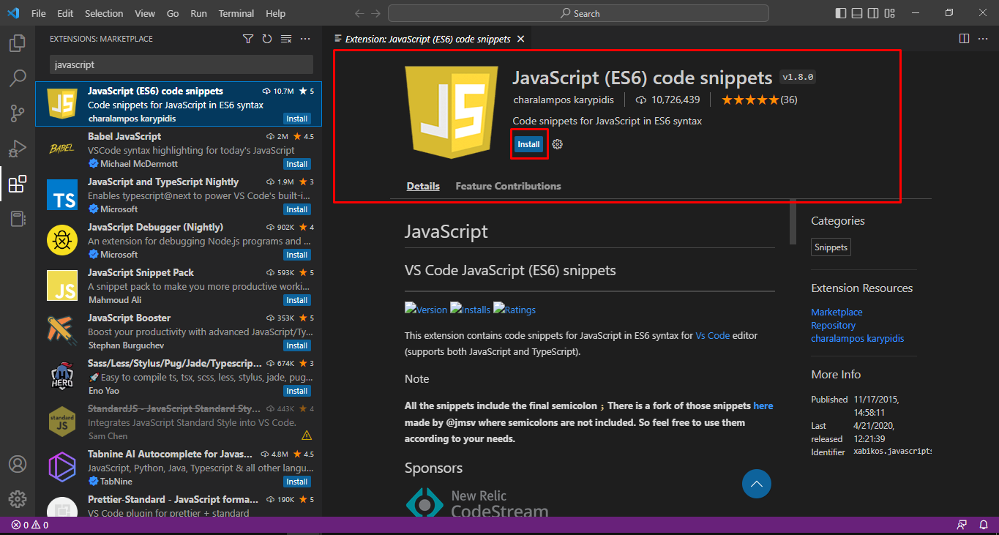  

5. También necesitamos instalar una extensión para html, en la barra de busquedas colocamos **html**, despues de que nos aparesca, seleccionamos una de ellas.


6. Y daremos clic en el boton de **install** para instalar la extension.


Listo, con esos sencillos pasos se habra instalado una extensión en VSCode para JavaScript y para html.  

### COMENZAR CON LA PROGRAMACIÓN EN JAVASCRIPT
Como primer programa debemos crear el típico "Hola mundo".
Debemos seguir los siguientes pasos para lograrlo:

1. En la carpeta ***codigos*** que creamos, tenemos que crear una carpeta que lleve por nombre ***JS***.

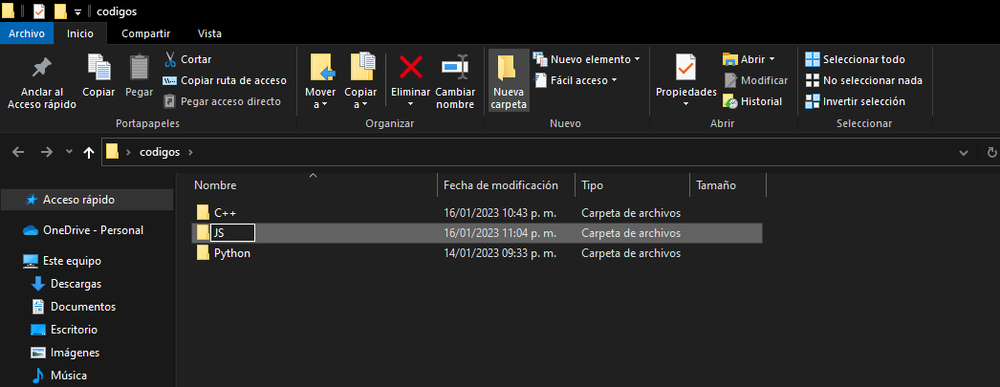

2. Ahora nos dirigiremos a VSCode, en el apartado de ***File*** seleccionamos ***open folder***.


3. Nos mostrar una ventana para seleccionar cual carpeta queremos abrir. Estando en esa ventana, tenemos que elegir primero ***Escritorio*** y nos debe aparecer la carpeta que creamos que lleva por nombre ***codigos***, le damos doble clic a la carpeta para abrirla.


4. Dentro de la carpeta debe de estar la carpeta ***JS*** que creamos, la seleccionamos, tenemos que revisar en la parte inferior que este el nombre de la carpeta y damos clic en ***Seleccionar carpeta***.

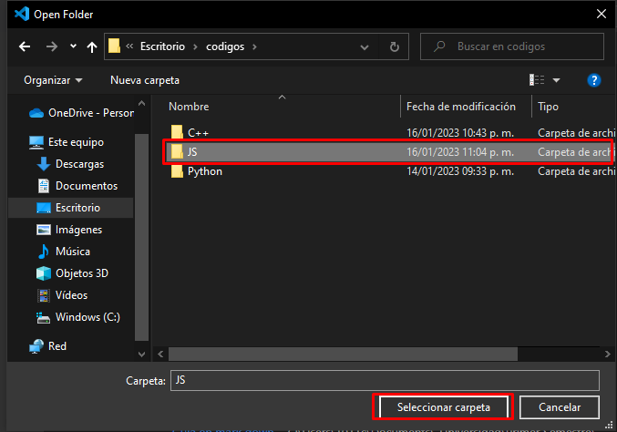

5. Nos aparecera el siguiente aviso, tenemos que darle clic en ***Yes, I trust the authors***.


6. Una vez dando clic en el mensaje, nos debe de aparecer en el apartado superior izquierdo el nombre de la carpeta ***JS***. Si no aparece la carpeta, vuelvalo a realizar a partir de paso 2.


7. Para crear un nuevo archivo se necesita posicionar el cursor sobre el nombre de la carpeta ***JS***, apareceran varias opciones, seleccionamos el que dice ***New file***:

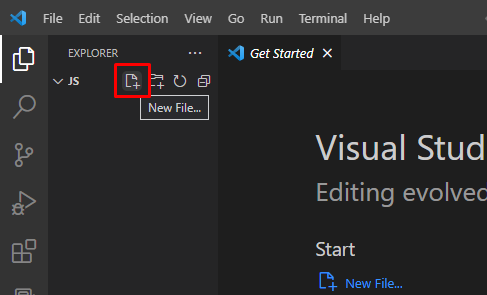

### HOLA MUNDO 
Para imprimir en pantalla un mensaje que diga ***Hola mundo***, haremos lo siguiente:

1. Crearemos un nuevo archivo en la carpeta de ***JS*** que hemos abierto recientemente y colocaremos ***el nombre del archivo*** con la extensión de JS que es ***.js*** (cada que se cree un programa en JS se deben especificar estos elementos) además, el nombre no puede contener espacios, se deben sustituir los espacios por guiones bajos. En este caso nombraremos al archivo como: ***hola_mundo.js*** y daremos enter para que se cree.

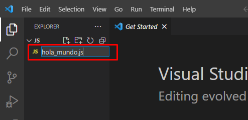

2. Aparecerá de la siguiente manera, y en la parte señalada es el apartado donde se escribirá el codigo del programa:

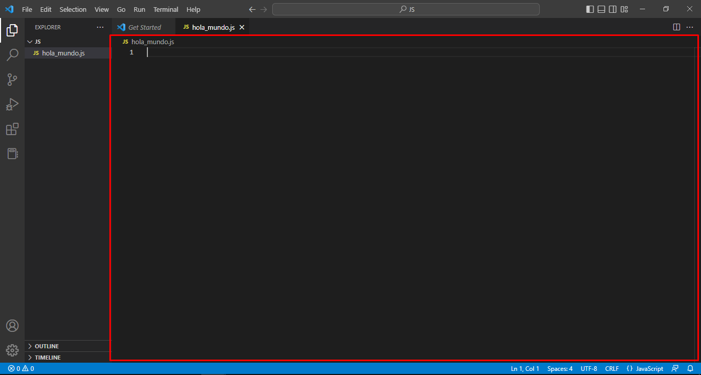

3. Pero para poder usar el archivo de JavaScript necesitamos de un archivo HTML, entonces tambien crearemos un archivo .html y para no confundirnos, le llamaremos **hola_mundo.html**.


4. Primero haremos la estructura del html, para que sea rápido escribiremos lo siguiente:

```
!
```
 


5. Y daremos un enter, el editor en automatico creará la estructura html


6. Ahora, en el siguiente apartado (que esta debajo de las etiquetas `<title>`) es la única parte que vamos a modificar.


7. En ese apartado colocaremos lo siguiente:

```
scri
```

8. El editor de texto nos sugerirá algunas opciones, nosotros seleccionaremos la segunda:


9. Ahora, en el apartado donde están las comillas, debemos enlazar al archivo de JavaScript, entre las comillas vamos a colocar lo siguiente:

```
./
```

10. El editor de texto nos sugerira nuevamente algunas opciones, y nosotros ejegiremos al archivo que tiene la extensión .js que en este caso se llama **hola_mundo.js**


11. Tenemos que vericar que haya quedado todo correctamente, pero para poder usar el archivo, necesitamos guardarlo, en la parte superior, donde esta el nombre del archivo, vemos que tiene un punto blanco, eso significa que necesita guardarse.

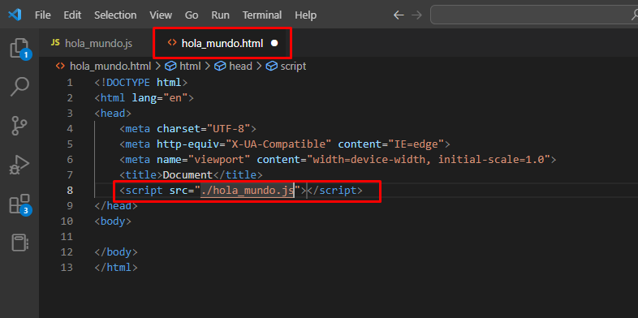

12. Para poder guardarlo únicamente debemos de presionar las teclas **Ctrl** y **S** al mismo tiempo. Despues podra notar que el punto blanco ha desaparecido, lo que significa que se ha guardado el archivo.  

13. De momento ya tenemos el archivo de html listo, pero ahora falta el archivo de JavaScript.

14. En el archivo de JavaScript vamos a escribir el siguiente código:

```javascript
console.log("Hola mundo");
```

15. De igual manera apreciamos que aparece un punto blanco en el nombre del archivo, por lo que necesitamos guardarlo para poder usar el archivo.

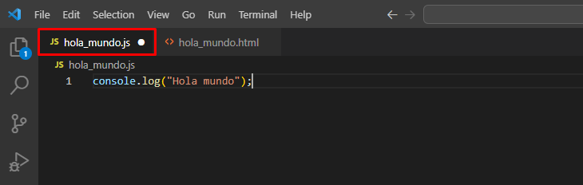

12. Para poder guardarlo únicamente debemos de presionar las teclas **Ctrl** y **S** al mismo tiempo. Despues podra notar que el punto blanco ha desaparecido, lo que significa que se ha guardado el archivo.  

> NOTA: Para hacer impresiones en pantalla hacemos uso de `console.log()` esto nos permite mostrar datos en consola.

### COMANDOS DE EJECUCIÓN DE UN PROGRAMA
Para JavaScript existen diferentes formas de ejecutar un archivo, sin embargo, nosotros usaremos la ejecución en un navegador, por lo que es necesario seguir los siguientes pasos:

1. Presiona las teclas **Ctrl** y **R** al mismo tiempo, en la ventana que aparezca, escribe ***cmd*** y da clic en ***aceptar***.


2. Al ejecutarlo nos aparecera lo siguiente, eso es la terminal de Windows: 


> NOTA: Los siguientes comandos son los que se van a estar utilizando durante la guía, es necesario que se los aprenda.

3. Para ver cuales son las carpetas que se encuentran en una ubicación se utiliza el comando:
```
> dir
```

4. Necesitamos escribir el comando y dar enter, lo que tenemos que buscar que nos aparezca es la carpeta **Desktop** o **Escritorio** dependiendo del idioma de su ordenador.


5. Al encontrarlo, tenemos que seleccionarlo y abrirlo, para poder hacer eso se usa el comando:
```
> cd "nombre de la carpeta"
```

6. Colocamos el comando y el nombre de la carpeta, en este caso es **"Desktop"**, al dar enter debemos notar que en la ultima linea aparecera una diagonal inversa y posterior el nombre de la carpeta que habíamos especificado:


7. Después de eso usaremos nuevamente el comando **dir** para verificar las el contenido de la carpeta que elegimos, tenemos que encontrar que esta la carpeta **codigos** en su interior:


8. Al encontrar la carpeta, usaremos el comando **cd** para ingresar en ella, de igual manera, al dar enter nos debe de aparecer en la ultima linea de texto una diagonal inversa seguido el nombre de la carpeta que espeficicamos.


9. Ahora necesitamos verificar el contenido de la carpeta con **dir**, tenemos que encontrar la carpeta Python.

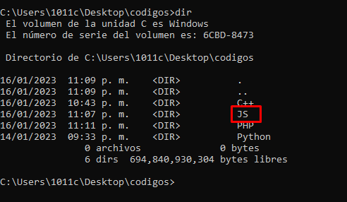

10. Al encontrarla, la seleccionaremos con **cd**.

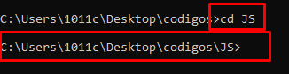

11. Necesitamos buscar el archivo que creamos donde esta el mensaje de JavaScript y html, usaremos nuevamente el comando **dir** y veremos si se encuentra el archivo.

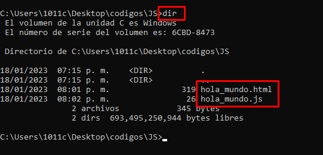

12. Al encontrarlo, necesitamos ejecutarlo, esto se hace con el siguiente comando:
```
> "nombre_del_archivo".html
```

13. El comando lo unico que hace es abrir el archivo html, otra manera de abrirlo es desde el explorador de archivos, pero de esta forma también se puede, entonces escribirmos **hola_mundo.html** y damos enter:

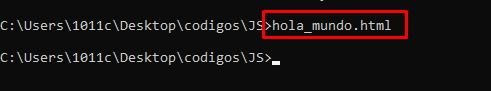

### PROCESO DE EJECUCUCIÓN DE UN PROGRAMA

14. Después del enter, se nos abrirá el archivo en el navegador, daremos clic derecho y seleccionamos **inspeccionar**


15. Luego damos clic en **console**


16. Como podremos notar, nos aparecerá el mensaje de "Hola mundo"


Esto es lo que se necesita hacer para poder crear un programa en JavaScript y poder ejecutarlo.  

---
Otro comando que le será útil al momento de usar la terminal de Windows para ejecutar programas de Python o de algún otro lenguaje de programación es el siguiente, lo que hace es permitirle salir de una carpeta:
```
> cd ..
```
Al presionar las teclas **Ctrl** y **C** al mismo tiempo, le ayuda a detener una ejecución.  

Para no tener que escribir nuevamente un comando que ya habia escrito puede usar las teclas de dirección que apuntan hacia arriba o hacia abajo para poder ver los comandos anteriores que habia escrito.

Para acompletar un nombre largo de una carpeta o archivo, puede escribir las primeras letras del nombre de la carpeta o archivo y presionar tabulación, este le acompletará el resto del nombre.

> ### NOTA: ES muy importante que se aprenda los pasos para la creación de un archivo para JavaScript y los pasos para ejecutar un programa, así como los comandos a usar en la terminal de Windows, ya que serán los mismos que se estaran usando para los siguientes ejemplos de algoritmos escritos en JavaScript.

### 10 ALGORITMOS DE EJEMPLO ESCRITOS EN JAVASCRIPT
***1. Impresión de un numero:** Usted debera de programar un programa que cree una variable y le asigne un valor, además de que debe de imprimir en consola el numero.*

Crearemos un archivo html y javascript que se llamen **numero.html** y **numero.js** el archivo html lo crearemos con lo siguiente:

Escribimos el siguiente signo y damos enter

```
!
```

Debajo de la etiqueta `<title>` tenemos que escibir lo siguiente

```html
<script src="./numero.js"></script>
```

Ahora, dentro del archivo .js escribiremos lo siguiente:

```javascript
var numero = 5;

console.log(numero);
```

Despues de haber guardado ambos archivos lo ejecutaremos, pero esta vez será desde el explorador de archivos, tenemos que encontrar el archivo html que acabamos de crear **numero.html** y le daremos doble clic


Ahora, en el navegador nos dirigiremos a la consola y tendremos que visualizar lo siguiente:


Nos podemos percatar que en efecto se muestra el numero que escribimos.

> NOTA: Para que se pueda usar una variable se debe de especificar que se trata de una variable, esto se hace con la palabra `var` seguido del nombre de la variable (el nombre puede ser el que sea) y para asignar un valor se hace uso del signo `=` seguido del valor que se quiere asignar, y también se debe de cerrar con un `;` al finalizar cada instrucción.

***2. Área de un cuadrado:** El programa debe de calcular el área de un cuadrado, los valores deben estar especificados ya en el programa. se usaran unicamente dos variables.*

Crearemos un archivo html y javascript que se llamen **area_cuadrado.html** y **area_cuadrado.js** el archivo html lo crearemos con lo siguiente:

Escribimos el siguiente signo y damos enter

```
!
```

Debajo de la etiqueta `<title>` tenemos que escibir lo siguiente

```html
<script src="./area_cuadrado.js"></script>
```

Ahora, dentro del archivo .js escribiremos lo siguiente:

```javascript
const lado = 13;
const area = lado * lado;

console.log(area);
```

Despues de haber guardado ambos archivos lo ejecutaremos, pero esta vez será desde el explorador de archivos, tenemos que encontrar el archivo html que acabamos de crear **area_cuadrado.html** y le daremos doble clic

Ahora, en el navegador nos dirigiremos a la consola y tendremos que visualizar lo siguiente:


> NOTA: Otra forma de especifiar una variable es con la palabra `const` sin embargo esta palabra no crea especificamente variables pues son más bien una constante pues su valor, despues de ser especificado, no puede cambiar.

***3. Perímetro de un rectángulo:** El programa debe de calcular el perímetro de un rectángulo, las medidas de sus lados ya serán especificadas en el programa.*

Crearemos un archivo html y javascript que se llamen **perimetro_rectangulo.html** y **perimetro_rectangulo.js** el archivo html lo crearemos con lo siguiente:

Escribimos el siguiente signo y damos enter

```
!
```

Debajo de la etiqueta `<title>` tenemos que escibir lo siguiente

```html
<script src="./perimetro_rectangulo.js"></script>
```

Ahora, dentro del archivo .js escribiremos lo siguiente:

```javascript
let lado_menor = 23;
let lado_mayor = 65;
let perimetro = (lado_menor * 2) + (lado_mayor * 2);

console.log("El perimetro es: " + perimetro);
```

Despues de haber guardado ambos archivos lo ejecutaremos dando doble clic sobre el archivo **perimetro_rectangulo.html**
Ahora, en el navegador nos dirigiremos a la consola y tendremos que visualizar lo siguiente:


> NOTA: Además de las dos formas que antes se mencionaron, también se puede usar la palbra `let` para hacer referencia a que se va a utilizar una variable, sin embargo esta limita el uso de la variable, lo que hace que no se pueda usar la información que contien si esta dentro de un bloque. <br>
Para impresiones en la consola, se pueden imprimir diferentes tipos de datos, para unirlos se concatena con el signo `+`

***4. Factorial de un numero:** Tiene que encontrar el factorial de un numero, tomando en cuenta que el factorial se refiere a que se debe de multiplicar el numero por todos sus antecesores.*

Crearemos un archivo html y javascript que se llamen **factorial.html** y **factorial.js** el archivo html lo crearemos con lo siguiente:

Escribimos el siguiente signo y damos enter

```
!
```

Debajo de la etiqueta `<title>` tenemos que escibir lo siguiente

```html
<script src="./factorial.js"></script>
```

Ahora, dentro del archivo .js escribiremos lo siguiente:

```javascript
let numero = 5;

for (let i = 4; numero > 0; i--){
    console.log(numero + " * " + i);
    numero += numero * i;
    console.log(numero);
}

console.log("El factorial es: " + numero);
```

Despues de haber guardado ambos archivos lo ejecutaremos dando doble clic sobre el archivo **factorial.html**
Ahora, en el navegador nos dirigiremos a la consola y tendremos que visualizar lo siguiente:


> NOTA: En JavaScript también existen los bucles, el bucle `for()` lleva dentro de los parentesis tres parametros, el primero es una variable, el segundo es la condición, y el tercero es el incremento de la variable.

***5. Exámen militar:** Para un exámen militar sólo pueden ser militares las personas que tienen una estatura minima de 1.75 para los hombres y 1.60 para las mujeres, ayude a crear un programa que identifique quienes son aptos para ser militares, el programa debera mostrar mensajes de si tienen la altura requerida para ser militares.*

Crearemos un archivo html y javascript que se llamen **militar.html** y **militar.js** el archivo html lo crearemos con lo siguiente:

Escribimos el siguiente signo y damos enter

```
!
```

Debajo de la etiqueta `<title>` tenemos que escibir lo siguiente

```html
<script src="./militar.js"></script>
```

Ahora, dentro del archivo .js escribiremos lo siguiente:

```javascript
let estatura = 1.68;
let genero = "M";

if (genero == "M" && estatura > 1.60){
    console.log("Usted es una mujer con la altura suficiente, es apta para ser militar");
} else if (genero == "H" && estatura > 1.70){
    console.log("Ested es un hombre con la altura suficiente, es apto para ser militar");
} else {
    console.log("Lo lamentamos, usted no es apto para ser militar")
}
```

Despues de haber guardado ambos archivos lo ejecutaremos dando doble clic sobre el archivo **militar.html**
Ahora, en el navegador nos dirigiremos a la consola y tendremos que visualizar lo siguiente:


Nos podemos percatar que en efecto se muestra el numero que escribimos.

> NOTA: Para que el programa pueda tomar decisiones se hace uso de las palabras `if()` dentro de los parentesis se coloca la condición a evaluar `else if()` si la primer condición no se ejecuta, esta palabra hace que el programa evalue una segunda condición la cual va también dentro de los parentesis `else` si ninguna de las condiciones se ejecuta, por defecto se ejecutará esta condición

***6. Numeros pares:** El programa debe de generar 10 numeros pares, los cuales deben.*

Crearemos un archivo html y javascript que se llamen **pares.html** y **pares.js** el archivo html lo crearemos con lo siguiente:

Escribimos el siguiente signo y damos enter

```
!
```

Debajo de la etiqueta `<title>` tenemos que escibir lo siguiente

```html
<script src="./perimetro_rectangulo.js"></script>
```

Ahora, dentro del archivo .js escribiremos lo siguiente:

```javascript
for (let i = 1; i <= 10; i += 2){
    console.log(i)
}
```

Despues de haber guardado ambos archivos lo ejecutaremos dando doble clic sobre el archivo **pares.html**
Ahora, en el navegador nos dirigiremos a la consola y tendremos que visualizar lo siguiente:


> NOTA: El tercer perimetro del `for` es para ver de cuanto en cuanto va a ir incrementando la variable, en este caso le hemos especificado que incremetará de dos en dos.

***7. Calculadora:** El programa debera de poder hacer los cuatro tipos de operaciones básicas, sin embargo lo deberá de hacer con una función.*

Crearemos un archivo html y javascript que se llamen **calculadora.html** y **calculadora.js** el archivo html lo crearemos con lo siguiente:

Escribimos el siguiente signo y damos enter

```
!
```

Debajo de la etiqueta `<title>` tenemos que escibir lo siguiente

```html
<script src="./calculadora.js"></script>
```

Ahora, dentro del archivo .js escribiremos lo siguiente:

```javascript
let numero_uno = 10, numero_dos = 12;

function suma(numero_uno, numero_dos){
    return numero_uno + numero_dos;
}

function resta(numero_uno, numero_dos){
    return numero_uno - numero_dos;
}

function multiplicacion(numero_uno, numero_dos){
    return numero_uno * numero_dos;
}

function division(numero_uno, numero_dos){
    return numero_uno / numero_dos;
}

console.log(suma(numero_uno, numero_dos));
console.log(resta(numero_uno, numero_dos));
console.log(multiplicacion(numero_uno, numero_dos));
console.log(division(numero_uno, numero_dos));
```

Despues de haber guardado ambos archivos lo ejecutaremos dando doble clic sobre el archivo **calculadora.html**
Ahora, en el navegador nos dirigiremos a la consola y tendremos que visualizar lo siguiente:


> NOTA: Para especificar que se va a crear una función se hace uso de la palabra `function` seguido del nombre que se le va a dar y entre los paréntesis los parametros que se le van a pasar, y para mandarla a llamar se coloca solo el nombre de la función y entre los paréntesis los parámetros en caso de que sean necesarios. <br>
Nos podemos dar cuenta de que se usa la palabra `return` esto lo que hace es solo devolver un valor.

***8. Ordenar numeros con el metodo de la burbuja:** Con la ayuda de un arreglo, el cual tendra 5 valores numericos en desorden, y con la ayuda de un ciclo y una estructura de condicion debera de ordenar los datos del arreglo.*

Crearemos un archivo html y javascript que se llamen **burbuja.html** y **burbuja.js** el archivo html lo crearemos con lo siguiente:

Escribimos el siguiente signo y damos enter

```
!
```

Debajo de la etiqueta `<title>` tenemos que escibir lo siguiente

```html
<script src="./pburbuja.js"></script>
```

Ahora, dentro del archivo .js escribiremos lo siguiente:

```javascript
let arreglo = [3, 6, 2, 4, 5];
let auxiliar = 0;

console.log(arreglo);

for (let j = 0; j < 4; j++){
    for (let i = 0; i < 4; i ++){
        if (i < 4){
            if (arreglo[i] > arreglo[i + 1]){
                auxiliar = arreglo[i];
                arreglo[i] = arreglo[i + 1];
                arreglo[i + 1] = auxiliar;
            }
        }    
    }
}

console.log(arreglo);
```

Despues de haber guardado ambos archivos lo ejecutaremos dando doble clic sobre el archivo **burbuja.html**
Ahora, en el navegador nos dirigiremos a la consola y tendremos que visualizar lo siguiente:


> NOTA: Para poder resolver este ejercicio necesitamos de dos bucles, pues el metodo de burbuja necesita recorrer todos sus elementos las veces dependiendo de los elementos que tenga en su interior. <br>
Una cosa nueva que usamos fueron los arreglos, estos se especifican con la ayuda de dos corchetes `[]`

***9. Área de un circulo:** Los datos requeridos para realizar las operaciones ya los contendra el programa, para ello se necesita de la fórmula que es: pi * r^2*

Crearemos un archivo html y javascript que se llamen **area_circulo.html** y **area_circulo.js** el archivo html lo crearemos con lo siguiente:

Escribimos el siguiente signo y damos enter

```
!
```

Debajo de la etiqueta `<title>` tenemos que escibir lo siguiente

```html
<script src="./area_circulo.js"></script>
```

Ahora, dentro del archivo .js escribiremos lo siguiente:

```javascript
let area = 0, pi = 3.1415, r = 4;

area = pi * (r * r);

console.log(area);
```

Despues de haber guardado ambos archivos lo ejecutaremos dando doble clic sobre el archivo **area_circulo.html**
Ahora, en el navegador nos dirigiremos a la consola y tendremos que visualizar lo siguiente:


> NOTA: En este programa nos podemos dar cuenta que las variables pueden ser especificadas todas en una misma linea, eso es posible.

***10. Exponente binario:** Para poder hacer el programa, es necesario de un ciclo repetitivo, ten en cuenta que la base es 2 y siempre se va aumentando.*

Crearemos un archivo html y javascript que se llamen **base.html** y **base.js** el archivo html lo crearemos con lo siguiente:

Escribimos el siguiente signo y damos enter

```
!
```

Debajo de la etiqueta `<title>` tenemos que escibir lo siguiente

```html
<script src="./base.js"></script>
```

Ahora, dentro del archivo .js escribiremos lo siguiente:

```javascript
let base = 2;
let exponente = 1;

for (let i = 0; i < 8; i++){
    exponente = exponente * base;
}

console.log(exponente);
```

Despues de haber guardado ambos archivos lo ejecutaremos dando doble clic sobre el archivo **base.html**
Ahora, en el navegador nos dirigiremos a la consola y tendremos que visualizar lo siguiente:


> NOTA: Los binarios, su base multiplicada por su exponente, al ser un byte (que contiene 8 bit) da como resultado 256. Para lograr esto se hizo las potencias con la ayuda de un ciclo repetitivo.


## PHP
### ¿QUÉ ES PHP?
PHP es un lenguaje de programación destinado a desarrollar aplicaciones para la web y crear páginas web, favoreciendo la conexión entre los servidores y la interfaz de usuario.

Entre los factores que hicieron que PHP se volviera tan popular, se destaca el hecho de que es de código abierto.

Esto significa que cualquiera puede hacer cambios en su estructura. En la práctica, esto representa dos cosas importantes:
1. Es de **código abierto**, no hay restricciones de uso vinculadas a los derechos. El usuario puede usar PHP para programar en cualquier proyecto y comercializarlo sin problemas.
2. Está en **constante perfeccionamiento**, gracias a una comunidad de desarrolladores proactiva y comprometida.

### PARADIGMAS QUE SE PUEDEN IMPLEMENTAR
PHP es multiparadigma pues soporta más de un paradigma de programación, la programación imperativa, la programación orientada a objetos y la programación funcional.

### APLICACIONES COMUNES DEL LENGUAJE
PHP suele usarse en el desarrollo web, para hacer que las páginas web sean dinámicas, PHP es un lenguaje que es de código abierto, por lo que la comunidad ha ido perfeccionándolo, de tal manera que tiene una gran agilidad de respuesta, gracias a ello las páginas que implementan PHP pueden tener muchos diseños y aún asi podrá cargar rápidamente. Además PHP suele usarse también para conexiones a bases de datos, PHP puede hacer estas conexiones con una base de datos enorme. 

### PROS Y CONTRAS VS OTROS LENGUAJES
#### **VENTAJAS:**
1. **Código abierto:** Esta es la principal ventaja que puede tener, pues su estructura puede ser modificada libremente, además se puede hacer comercio sin necesidad de tener problemas por derechos de autor.
2. **Comunidad:** Al ser de código abierto, PHP tiene una gran comunidad que trabaja para mejorarla.
3. **Fácil de aprender:** PHP es bastante simple y fácil de aprender y utilizar, sin embargo, también tiene algunas funciones y características que son complejas.
4. **Seguridad:** Como constantemente se esta actualizando, si llega a surgir un error, este es solucionado en poco tiempo y ofrece seguridad ante ataques informáticos.
5. **Fácil instalación:** PHP puede ser instalado facilmente, pero es neceario tener también el intérprete o servidor para poder usarlo. Uno de ellos puede ser XAMPP. 
6. **Integración con la base de datos:** Tinen un amplio soporte a base de datos.

#### **DESVENTAJAS:**
1. **Necesidad de un servidor web para funcionar:** Un dato interesante y que lo diferencia de las otras alternativas es que se ejecuta en el servidor de la web, generando el código HTML que es enviando al navegador. No recibe el código real, sino solo el resultado de ejecución. Para su instalación esto es necesario, porque es el que va a interpretar el lenguaje.
2. **Riesgo de seguridad si no se configura bien:** A pesar de ser un lenguaje de programación muy seguro, tiene ciertos grados de complejidad para usarse y configurarse. Se necesitan conocimientos profundos para ajustar correctamente esas barreras de seguridad que puede haber en el servidor. Además, al no poder ocultar el código fuente, se corre el riesgo de que otra persona pueda visualizarlo si utiliza la misma PC donde fue instalado. Una excelente alternativa para utilizar son las aplicaciones que ayudan a encriptarlo.

### INSTALACIÓN
1. Para usar PHP necesitamos descargar XAMPP, este intérprete lo descargaremos desde la siguiente liga [https://www.apachefriends.org/es/index.html](https://www.apachefriends.org/es/index.html "XAMPP")

2. Estando en la página debemos de seleccionar el sistema operativo que tenemos, en este caso seleccionaré Windows, con esto iniciará la descarga del archivo.


3. Al terminar de descargar el archivo lo buscaremos en el explorador de archivos, por lo general se almacena en **descargas**


4. Cuando encontremos el archivo, le daremos en ejecutar como administrador y con esto comenzará la instalación:


5. Básicamente solo es dar clic en **next** no es necesario mover nada:

  
  


6. Después de eso iniciará la instalación de XAMPP, debe de esperar un momento ya que suele tardar un poco:


7. Cuando termine la instalación, lo unico que tiene que hacer es dar clic en finalizar. Esto ejecutará la aplicación.

### CONFIGURACIÓN
#### **ENTORNO (SISTEMA OPERATIVO)**
Lo único que se debe de configurar en el ordenador es que en XAMPP se debe de ejecutar el servidor **Apache**

1. Al estar en XAMPP debemos ubicar donde dice **start** en el apartado de **Apache** y le daremos clic.


2. Tiene que aparecer de la siguiente manera para saber que el servidor **Apache** se esta ejecutando correctamente:


Si de casualidad no aparece de esa manera, debería desinstalar XAMPP y volver a instalar.

#### **ENTORNO (EDITOR DE TEXTO)**
Para poder usar el lenguaje de programación, necesita usar un editor de texto, algunos editores de texto recomendados son mencionados en este proyecto (Sublime Text, Atom o VSCode), en este caso se hara uso de VSCode. Es recomendable usar una extensión de PHP para este editor de texto pues gracias a esto se tiene una gran variedad de herramientas para poder utilizar. Para poder instalar una extensión se hace lo siguiente:  
1. Primero se ejecuta VSCode.

  

2. Posterior a eso se debe de seleccionar el apartado de extensiones:

  

3. Después, aparece un apartado donde se pueden hacer busquedas, ahi colocaremos **PHP**.

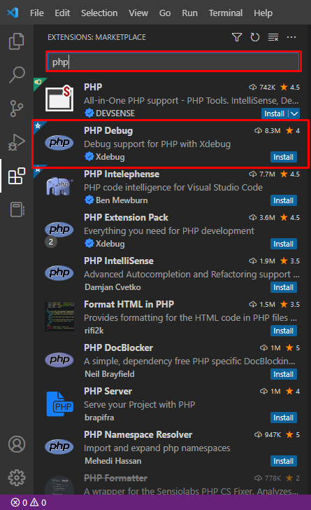  

4. Por ultimo seleccionamos la primer opción que nos aparece y daremos clic en **install**.  

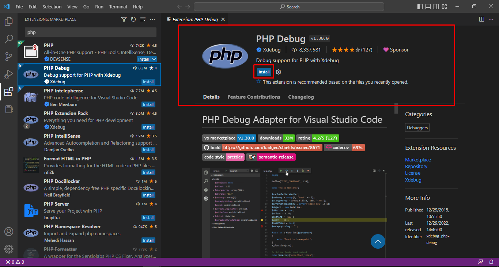  

Listo, con esos sencillos pasos se habra instalado una extensión en VSCode para PHP.  

### COMENZAR CON LA PROGRAMACIÓN EN PHP
Como primer programa debemos crear el típico "Hola mundo".
Debemos seguir los siguientes pasos para lograrlo:

1. Para poder crear los codigos y ejecutarlos debemos de guardarlos en una carpeta especial de XAMPP, por ello deberemos ubicar el almacenamiento, dar clic en él y seleccionar la carpeta **xampp**


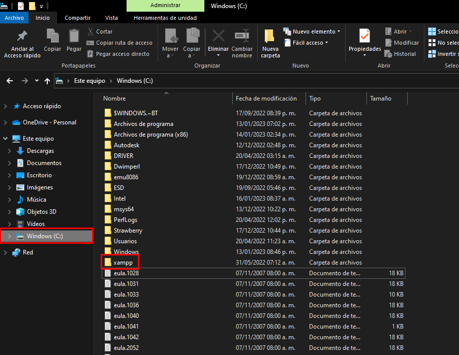

2. Al abrir la carpeta **xampp** deberemos de ubicar la carpeta **htdocs**

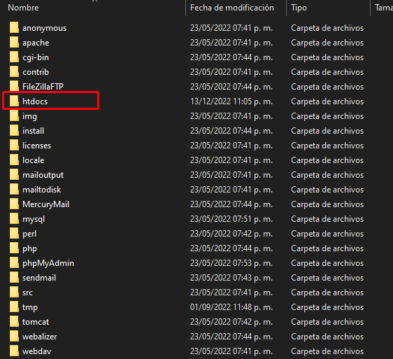

3. Al abrirlo, deberemos de crear una carpeta que en este caso llamaremos **codigos**

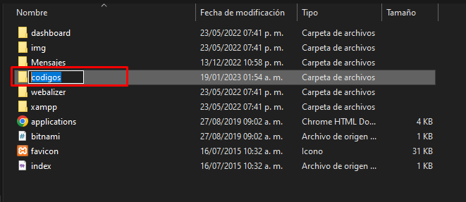

4. Despues de haberlo creado necesitamos abrirlo en **VSCode**, para ello entramos a VSCode y arrastramos la carpeta **codigos** hacia el editor de texto.

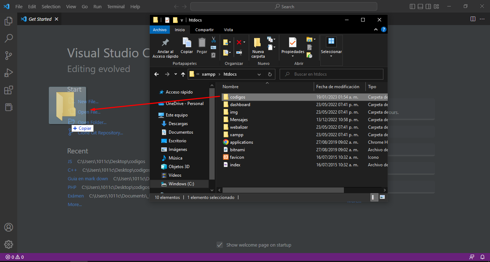

5. Nos aparecera el siguiente aviso, tenemos que darle clic en ***Yes, I trust the authors***.


6. Una vez dando clic en el mensaje, nos debe de aparecer en el apartado superior izquierdo el nombre de la carpeta ***codigos***. Si no aparece la carpeta, vuelvalo a realizar a partir de paso 4.

7. Para crear un nuevo archivo se necesita posicionar el cursor sobre el nombre de la carpeta ***codigos***, apareceran varias opciones, seleccionamos el que dice ***New file***:

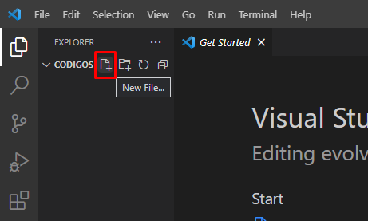

### HOLA MUNDO 
Para imprimir en pantalla un mensaje que diga ***Hola mundo***, haremos lo siguiente:

1. Crearemos un nuevo archivo en la carpeta de ***PHP*** que hemos abierto recientemente y colocaremos ***el nombre del archivo*** con la extensión de PHP que es ***.php*** (cada que se cree un programa en PHP se deben especificar estos elementos) además, el nombre no puede contener espacios, se deben sustituir los espacios por guiones bajos. En este caso nombraremos al archivo como: ***hola_mundo.php*** y daremos enter para que se cree.

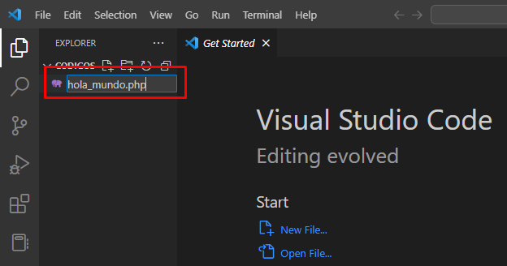

2. Aparecerá de la siguiente manera, y en la parte señalada es el apartado donde se escribirá el codigo del programa:

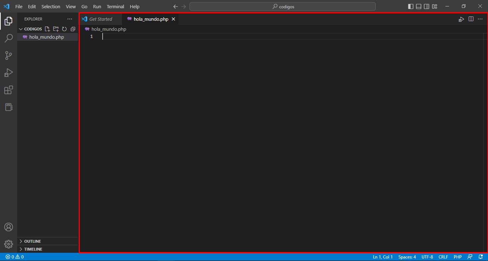

En el codigo pondremos lo siguiente:
```php
<?php
echo "Hola mundo";
?>
```

4. Cuando terminamos de escribir el código, necesitamos guardarlo, en la parte superior, donde esta el nombre del archivo, vemos que tiene un punto blanco, eso significa que necesita guardarse.

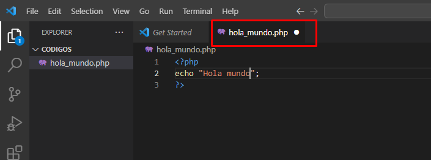

5. Para poder guardarlo únicamente debemos de presionar las teclas **Ctrl** y **S** al mismo tiempo. Despues podra notar que el punto blanco ha desaparecido, lo que significa que se ha guardado el archivo.  

> NOTA: Para hacer impresiones en pantalla siempre se debe usa `echo` entre comillas el mensaje que se va imprimir y debe cerrar con un `;`

### PROCESO DE EJECUCIÓN DE UN PROGRAMA
Para que podamos ejecutar el programa necesitamos hacer uso de un navegador.

1. Ejecutar el servidor apache en XAMPP, para ello nos dirigimos a XAMPP,debemos ubicar donde dice **start** en el apartado de **Apache** y le daremos clic.


2. Tiene que aparecer de la siguiente manera para saber que el servidor **Apache** se esta ejecutando correctamente:


3. Depués de eso, nos dirigimos al navegador de preferencia, en este casoo se usara **Chrome** de ejemplo:


4. En la barra de busquedas debemos de escribir lo siguente:

```
localhost/"nombre de la carpeta"/"nombre del archivo".php
```

5. En este caso será **localhost/codigos/hola_mundo.php** y daremos enter.


6. Nos debera de mostrar el mensaje de "Hola mundo"


> ### NOTA: Es de gran importancia que se logre memorizar los pasos para la creación de un archivo para php así como los pasos para podre ejecutar un programa, puesto a que se estarán utilizando para los algoritmos de ejemplo.

### 10 EJEMPLOS DE ALGORITMOS PROGRAMADOS EN PHP

***1. Suma:** Programe un programa que sea capaz de realizar una suma con dos numeros, los cuales deberan ser ya definidos en el programa, además de que se debe de crear una tercer variable en donde almacenar el resultado de la operación.*

Primero debera crear el archivo que se llamará **suma.php** y en el debera de poner el siguiente codigo:

```php
<?php

$numero_uno = 15;
$numero_dos = 5;

$resultado = $numero_uno + $numero_dos;

echo $resultado;

?>
```

Terminando de hacer este codigo lo guardaremos, verificamos que este corriendo **Apache** en XAMPP, después nos dirigimos al navegador y colocamos:

```
localhost/codigos/suma.php
```

Esto nos debera de dar la siguiente salida:


> NOTA: En php para declarar una variable es  necesario escribir el signo de `$` seguido del nombre de la variable, seguidito.

***2. Unir palabras:** Usted necesita crear un programa donde se declaren varias variables, cada una tendra un texto diferente, al final unira todas esas palabras y las mostrara en un mensaje.*

Primero debera crear el archivo que se llamará **unir.php** y en el debera de poner el siguiente codigo:

```php
<?php

$a = "hola";
$b = " como ";
$c = "estas";

$resultante = $a.$b.$c;

echo $resultante;

?>
```

Terminando de hacer este codigo lo guardaremos, verificamos que este corriendo **Apache** en XAMPP, después nos dirigimos al navegador y colocamos:

```
localhost/codigos/unir.php
```

Esto nos debera de dar la siguiente salida:


> NOTA: En php para hacer una concatenación, no se hace uso del signo `+` como en otros lenguajes, mas bien se hace uso de un `.`

***3. Genero de una persona:** Cree un programa que sea capaz de evaluar si una persona es hombre o mujer, debera mostrar un mensaje en pantalla dependiendo del genero de la persona.*

Primero debera crear el archivo que se llamará **genero.php** y en el debera de poner el siguiente codigo:

```php
<?php

$genero = "h";

if ($genero == "h" or $genero == "H"){

    echo "Usted es hombre";

} else if ($genero == "m" or $genero == "M") {

    echo "Usted es mujer";

} else {

    echo "usted no ha especificado correctamente su genero";

}

?>
```

Terminando de hacer este codigo lo guardaremos, verificamos que este corriendo **Apache** en XAMPP, después nos dirigimos al navegador y colocamos:

```
localhost/codigos/genero.php
```

Esto nos debera de dar la siguiente salida:


> NOTA: Al igual que en muchos lenguajes de programación, usted necesita colocar las palabras `if` para evaluar una primera condición, `else if` para evaluar una segunda condición y `else` por si ninguna de las condiciones se llega a cumplir, además se uso un operador logico `or` que evalua si una de las dos condiciones se cumplen, si es cierto se cumple la condición, y un operador relacional, que es el `==` este compara dos valores y si son iguales, retorna un valor de verdadero.

***4. Número mayor:** Declarados tres variables, cada uno con un numero distinto, el programa debe de evaluar cual de los tres números es mayor.*

Primero debera crear el archivo que se llamará **mayor.php** y en el debera de poner el siguiente codigo:

```php
<?php

$numero_uno = 15;
$numero_dos = 5;
$numero_tres = 11;

if ($numero_uno > $numero_dos && $numero_uno > $numero_tres){
    echo "El numero ".$numero_uno." es mayor";
} else if ($numero_dos > $numero_tres && $numero_dos > $numero_uno){
    echo "El numero ".$numero_dos." es mayor";
} else {
    echo "El numero ".$numero_tres." es mayor";
}

?>
```

Terminando de hacer este codigo lo guardaremos, verificamos que este corriendo **Apache** en XAMPP, después nos dirigimos al navegador y colocamos:

```
localhost/codigos/mayor.php
```

Esto nos debera de dar la siguiente salida:


> NOTA: Los operadores logicos en php pueden denotarse por signos o palabra, por ejemplo para simbolizar un `y` se puede colocar `and` o un `&&` este operador lógico es usado para comparar si dos condiciones son verdaderas, en dado caso que sea cierto se ejecuta.

***5. Promedio:** Dadas tres calificaciones que estaran declaradas ya en el programa, se debera de calcular el promedio de un alumno y se especificara si aprueba o reprueba.*

Primero debera crear el archivo que se llamará **promedio.php** y en el debera de poner el siguiente codigo:

```php
<?php

$calificacion_uno = 9;
$calificacion_dos = 5;
$calificacion_tres = 7;

$promedio = $calificacion_uno + $calificacion_dos + $calificacion_tres;

if ($promedio >= 6){
    echo "Felicidades, usted ha aprobado";
}else {
    echo "Lo lamentamos, pero usted reprobo";
}

?>
```

Terminando de hacer este codigo lo guardaremos, verificamos que este corriendo **Apache** en XAMPP, después nos dirigimos al navegador y colocamos:

```
localhost/codigos/promedio.php
```

Esto nos debera de dar la siguiente salida:


> NOTA: Para resolver este ejercicio hacemos uso de condicionales, y el operador relacional `>=` que evalua si el primer valor es igual o mayor al segundo, en caso de ser cierto, se ejecutara el codigo.

***6. Invertir palabra:** Usted generará un programa que evalue una palabra y la invierta.*

Primero debera crear el archivo que se llamará **invertir.php** y en el debera de poner el siguiente codigo:

```php
<?php

$palabra = ["h","o","l","a"];
$nueva_palabra = "";

foreach ($palabra as $letra){

    $nueva_palabra = $letra.$nueva_palabra;

}

echo $nueva_palabra;

?>
```

Terminando de hacer este codigo lo guardaremos, verificamos que este corriendo **Apache** en XAMPP, después nos dirigimos al navegador y colocamos:

```
localhost/codigos/invertir.php
```

Esto nos debera de dar la siguiente salida:


> NOTA: En php existen diferentes tipos de ciclos repetitivos, uno de ellos es `foreach` que recorre los elementos de un arreglo y los almacena en una variable que se va a crear, un arreglo es declarado con el uso de `[]` entre ellos va el contenido que pueden ser varios elementos. 

***7. Tablas:** Realice un programa que tenga la posibilidad de generar las tablas del 1 al 10 de los primeros 10 numeros.*

Primero debera crear el archivo que se llamará **tablas.php** y en el debera de poner el siguiente codigo:

```php
<?php

for ($i = 0; $i < 10; $i ++){
    for ($j = 0; $j < 10; $j ++){
        $resultado = $i * $j;
        echo "[".$i." * ".$j." = ".$resultado."]"."...........";        
    }
    echo "<p></p>";
}

?>
```

Terminando de hacer este codigo lo guardaremos, verificamos que este corriendo **Apache** en XAMPP, después nos dirigimos al navegador y colocamos:

```
localhost/codigos/tablas.php
```

Esto nos debera de dar la siguiente salida:


> NOTA: Otro de los bucles es el `for` este recibe tres parámetros, el primero es la declaración de una variable, el segundo es la condición para que se ejecute el codigo, y el tercero es el incremento

***8. Imprimir lista:** Se necesita crear una lista en la cual se pongan varios elementos, despues con la ayuda de un bucle se imprimira elemento por elemento.*

Primero debera crear el archivo que se llamará **lista.php** y en el debera de poner el siguiente codigo:

```php
<?php

$lista = ["hola", "como", "estas", 10, 43, true];

$longitud = 0;

while ($longitud <= 5){

    echo $lista[$longitud];
    echo "<p></p>";
    $longitud ++;

}

?>
```

Terminando de hacer este codigo lo guardaremos, verificamos que este corriendo **Apache** en XAMPP, después nos dirigimos al navegador y colocamos:

```
localhost/codigos/lista.php
```

Esto nos debera de dar la siguiente salida:


> NOTA: Otro bucle es el bucle `while` que entre sus parentesis debe de tener la condicion para que se ejecute, fuera debera de estar especificada ya la variable, y dentro deberá de estar el incremento.

***9. Media:** Dado un arreglo con 5 calificaciones, el programa debera de ordenar el arreglo si lo requiere, y debera de mostrar cual es la media, en este caso mostrara el elemento de la posicion 2*

Primero debera crear el archivo que se llamará **suma.php** y en el debera de poner el siguiente codigo:

```php
<?php

$calificaciones = [5, 7, 8, 6, 9];
$auxiliar = 0;

for ($i = 0; $i > 4; $i++){
    for ($j = 0; $j > 4; $j++){
        if ($j <= 3){
            if ($calificaciones[$j] > $calificaciones[$j + 1]){
                $auxiliar = $calificaciones[$j];
                $calificaciones[$j] = $calificaciones[$j + 1];
                $calificaciones[$j + 1] = $auxiliar;
            }
        }
    }
}

echo "La media es ".$calificaciones[2];

?>
```

Terminando de hacer este codigo lo guardaremos, verificamos que este corriendo **Apache** en XAMPP, después nos dirigimos al navegador y colocamos:

```
localhost/codigos/media.php
```

Esto nos debera de dar la siguiente salida:


> NOTA: En para acceder a un elemento en especifico de un arreglo se debe de colocar el nombre del arreglo seguido de `[]` y dentro de los corchetes se coloca la posicion del elemento, tomenmos en cuenta que en los arreglos, las posiciones inician desde `0`

***10. Calculadora:** Debera de generar un programa que tenga la posibilidad de hacer la cuatro operaciones básicas.*

Primero debera crear el archivo que se llamará **calculadora.php** y en el debera de poner el siguiente codigo:

```php
<?php

$numero_uno = 10;
$numero_dos = 5;

$operacion = "suma";
$resultado = 0;

if ($operacion == "suma"){
    $resultado = $numero_uno + $numero_dos;
    echo "El resultado de la ".$operacion." es ".$resultado;
} else if ($operacion == "resta"){
    $resultado = $numero_uno - $numero_dos;
    echo "El resultado de la ".$operacion." es ".$resultado;
} else if ($operacion == "multiplicacion"){
    $resultado = $numero_uno * $numero_dos;
    echo "El resultado de la ".$operacion." es ".$resultado;
} else if ($operacion == "division"){
    $resultado = $numero_uno / $numero_dos;
    echo "El resultado de la ".$operacion." es ".$resultado;
} else {
    echo "No se puede hacer esa operacion";
}

?>
```

Terminando de hacer este codigo lo guardaremos, verificamos que este corriendo **Apache** en XAMPP, después nos dirigimos al navegador y colocamos:

```
localhost/codigos/calculadora.php
```

Esto nos debera de dar la siguiente salida:


> NOTA: Para poder resolver este ejercicio es necesario el uso de varias condiciones, si alguna de ellas se cumple, entonces se va a ejecutar el codigo que esta dentro de la condición.

## Ensamblador
### ¿QUÉ ES ENSAMBLADOR?
El lenguaje ensamblador es el lenguaje de programación utilizado para escribir programas informáticos de bajo nivel, y constituye la representación más directa del Código máquina específico para cada arquitectura de computadoras legible por un programador. Aun hoy se utiliza en la programación de handler o manipuladores de dispositivos de hardware.

**Características**
El código escrito en lenguaje ensamblador posee una cierta dificultad de ser entendido directamente por un ser humano ya que su estructura se acerca más bien al lenguaje máquina, es decir, lenguaje de bajo nivel.
El lenguaje ensamblador es difícilmente portable, es decir, un código escrito para un Microprocesador, suele necesitar ser modificado, muchas veces en su totalidad para poder ser usado en otra máquina distinta, aun con el mismo Microprocesador, solo pueden ser reutilizados secciones especiales del código programado.
Los programas hechos en lenguaje ensamblador, al ser programado directamente sobre Hardware, son generalmente más rápidos y consumen menos recursos del sistema (memoria RAM y ROM). Al programar cuidadosamente en lenguaje ensamblador se pueden crear programas que se ejecutan más rápidamente y ocupan menos espacio que con lenguajes de alto nivel. 
Con el lenguaje ensamblador se tiene un control muy preciso de las tareas realizadas por un Microprocesador por lo que se pueden crear segmentos de código difíciles de programar en un lenguaje de alto nivel.
También se puede controlar el tiempo en que tarda una Rutina en ejecutarse, e impedir que se interrumpa durante su ejecución.
El lenguaje ensamblador es un código estructurado y gravitatorio desarrollado sobre un archivo de programación (.ASM), en el cual pueden existir varios programas, macros o rutinas que pueden ser llamados entre si.

### PARADIGMAS QUE SE PUEDEN IMPLEMENTAR
El lenguaje ensamblador soporta la programación imperativa y algunos ensambladores han incorporado elementos de programación estructurada para codificar el flujo de la ejecución.

### APLICACIONES COMUNES DEL LENGUAJE
El lenguaje ensamblador es usualmente utilizado en las siguientes circunstancias:
  * Mejorar la eficiencia de una rutina específica que se ha transformado en un cuello de botella
  * Obtener acceso a funciones de bajo nivel del procesador para realizar tareas que no son soportadas por los lenguajes de alto nivel
  * Escribir manejadores de dispositivos para comunicarse directamente con hardware especial tales como tarjetas de red
  * Trabajar en ambientes con recursos limitados puede requerir el uso del lenguaje ensamblador pues el código ejecutable puede ser menor que el generado por el compilador
Los lenguajes ensamblador tienen sus aplicaciones muy reducidas, se centran básicamente en aplicaciones de tiempo real, control de procesos y de dispositivos electrónicos. 

### PROS Y CONTRAS VS OTROS LENGUAJES
#### **VENTAJAS**
**Velocidad de ejecución:** Al consumir muy pocos recursos, el tiempo de ejecución es menor a comparación de los lenguajes de alto nivel.
**Eficiencia de tamaño:** Como es un lenguaje de bajo nivel, este está en contacto estrechamente con el hardware por lo que el espacio en memoria que utiliza es especifiado estrictamente lo que hace que no ocupe espacio en memoria inecesario.
**Flexibilidad:** Se refiere a que tiene ciertas ventajas en comparación a los lenguajes de alto nivel.

#### **DESVENTAJAS**
**Tiempo de programación:** Esta es una de las problematicas más sobresalientes, pues como tiene una sintaxis más apegada al lenguaje máquina que al lenguaje natural, es complejo entenderle, además de que se necesita especificar cada uno de los componentes a utilizar, siendo todo esto en conjunto un proceso demasiado tardado.
**Programas fuente grandes:** Debido a que se necesitan muchas instrucciones para realizar un proceso, los programas escritos en ensamblador suelen ser demasiado extensos, esto dificulta también el mantenimiento de los programas. 
**Peligro de afectar recursos inesperadamente:** Al estar en contacto directo con el hardware, si se cometen errores puede hacer que la máquina reconozca ejecuciones inválidas haciendo que llegue a congelarse o reiniciarse. 
**Falta de portabilidad:**
Debido a que los programas escritos en ensamblador estan relacionados con el hardware de la máquina, no se pueden compartir los programas escritos en un ordenador, puesto a que el programa solo funcionará en el ordenador en el que fue creado.

### INSTALACIÓN
Para usar **Ensamblador** es necesario de usar un emulador, este lo descargaremos desde la página siguiente:

1. Lo primero es dirigirse a la pagina del siguiente enlace [https://emu8086.waxoo.com/](https://emu8086.waxoo.com/)


### CONFIGURACIÓN
#### **ENTORNO (SISTEMA OPERATIVO)**
En el sistema operativo no es necesario modificar nada, ya que **Ensamblador** viene junto con el emulador **emu8086**

#### **ENTORNO (EMULADOR emu8086)**
2. Debemos de ubicar el instalador de **emu8086**


3. Ahora debemos de darde doble clic y únicamente debemos de dar clic en todos los apartados de **next**


4. Por último damos clic en **install**


### HOLA MUNDO 
Para imprimir en pantalla un mensaje que diga ***Hola mundo***, haremos lo siguiente:

1. Abrir el **emu8086** y dar clic en **new**


2. Ahora elegimos por defecto lo que nos sugiere el programa. Solo damos clic en **ok**


3. Se abrirá lo siguiente, ese es el apartado donde nosotros escribiremos el codigo.


### PRIMER PROGRAMA EN ENSAMBLADOR 

Par crear un programa en ensamblador es necesario dar clic en el apartado de **new**


### HOLA MUNDO

Ahora programaremos el típico **Hola mundo**, para ello vamos a escribir el siguiente código:

```ensamblador
pila segment stack 
    
    db 32 DUP('stack--')
    
pila ends
                                        

datos segment 
    
    letrero db 'Hola mundo','$'
    
datos ends                     


codigo segment 'code'
    
main proc FAR
    
    assume ss:pila, ds:datos, cs:codigo
                   
    push ds
    push 0       
                   
    mov ax, datos
    mov ds, ax
                  
    mov ah,09h
    mov dx, offset letrero
    int 21h                  
                  
    ret  
    
main endp        
codigo ends 
end main  

```

> NOTA: 

Después de eso, guardaremos el archivo de la siguiente manera:

1. Dar clic en donde dice **save** y seleccionar **save as**


2. Ahora le daremos un nombre al archivo:


3. Para ejecutarlo debemos dar clic en el apartado de **emulate**


4. Después de eso dar clic en el apartado de **Run**


5. Nos aparecerán las siguientes ventanas, daremos clic en **Ok**


6. Podremos visualizar que nos muestra el mensaje de **"Hola mundo"**


> ### NOTA: Debemos de aprendernos el proceso de ejecución de los programas, puesto a que esos pasos los estaremos usando para poder ejecutar los ejercicios posteriores.

### 5. 


## **CONCLUSIONES**
Este proyecto contiene temas escenciales sobre la programación, como el concepto de qué es, sus aplicaciones, historia, como esta relacionada con los algoritmos y diagramas de flujo. Para la programación se hacen uso de lenguajes de programación, tambien se especifica en este proyecto que es un lenguaje de programación, como se clasifican, como es el comportamiento de cada uno, los diversos paradigmas de programación que podemos utilizar, algunas de las herramientas que un desarrollador puede usar para construir sus propios programas, y sobre todo, se muestran ejemplos claros para poder usar los lenguajes de programación. En otras palabras, este proyecto es una guía completa para que una persona que apenas esta comenzado en el mundo de la programación pueda tomar como base para entender un poco de cómo funciona el desarrollo de software. 

## **BIBLIOGRAFÍA**
Syltec. (2023). ENGINEERING SYLTEC MAKING FUTURE. Obtenido de [https://syltec.es/blog/2021/10/05/programacion-un-poco-de-historia-y-conceptos-clave/#:~:text=Historia%20de%20la%20programaci%C3%B3n,introducido%20y%20automatizaba%20los%20procesos.](https://syltec.es/blog/2021/10/05/programacion-un-poco-de-historia-y-conceptos-clave/#:~:text=Historia%20de%20la%20programaci%C3%B3n,introducido%20y%20automatizaba%20los%20procesos. "Programación, un poco de historia y conceptos clave")

Andres. (2023). Curriculos Exploratorios en Tic. Obtenido de [http://contenidos.sucerman.com/nivel3/dispositivos/unidad1/leccion2.html](http://contenidos.sucerman.com/nivel3/dispositivos/unidad1/leccion2.html "¿Qué es la programación orientada a eventos?")

Iñiga J. (2023). Profile. Obtenido de [https://profile.es/blog/que-es-la-programacion-reactiva-una-introduccion/](https://profile.es/blog/que-es-la-programacion-reactiva-una-introduccion/ "¿Qué es la programación reactiva? Una introducción")

### VSCODE
Flores F. (2023). OpenWebinars. Obtenido de [https://openwebinars.net/blog/que-es-visual-studio-code-y-que-ventajas-ofrece/](https://openwebinars.net/blog/que-es-visual-studio-code-y-que-ventajas-ofrece/ "Qué es Visual Studio Code y qué ventajas ofrece")

### ATOM
Diego_Alberto. (2023). Práctica. Obtenido de [https://ull-esit-dsi-1617.github.io/estudiar-las-rutas-en-expressjs-alberto-diego/](https://ull-esit-dsi-1617.github.io/estudiar-las-rutas-en-expressjs-alberto-diego/ "Rutas de estudio")

### SUBLIME TEXT
Code. (2023). Code. Obtenido de [https://www.codedonostia.com/sublime-text-que-es-y-para-que-sirve/](https://www.codedonostia.com/sublime-text-que-es-y-para-que-sirve/ "Sublime Text: qué es y para qué sirve")

### PYTHON
Greyrat R. (2023). Barcelona Geeks. Obtenido de [https://barcelonageeks.com/paradigmas-de-programacion-en-python/](https://barcelonageeks.com/paradigmas-de-programacion-en-python/ "Paradigmas de programación en Pyhton")

Visus A. (2023). Esic. Obtenido de [https://www.esic.edu/rethink/tecnologia/para-que-sirve-python#:~:text=El%20lenguaje%20de%20programaci%C3%B3n%20Python,aplicaciones%20empresariales%20fiables%20y%20escalables.](https://www.esic.edu/rethink/tecnologia/para-que-sirve-python#:~:text=El%20lenguaje%20de%20programaci%C3%B3n%20Python,aplicaciones%20empresariales%20fiables%20y%20escalables. "¿Para qué sirve Python? Razones para utilizar este lenguaje de programación")

KeepCoding. (2023). KeepCoding. Obtenido de [https://keepcoding.io/blog/ventajas-y-desventajas-de-python/](https://keepcoding.io/blog/ventajas-y-desventajas-de-python/ "Ventajas y desventajas de Python")

### C++
Robledano A. (2023). OpenWebinars. Obtenido de [https://openwebinars.net/blog/que-es-cpp/](https://openwebinars.net/blog/que-es-cpp/ "Qué es c++: Características y aplicaciones")

### JAVASCRIPT 
Cervantes J.(2023). PensemosWeb. Obtenido de [https://www.pensemosweb.com/paradigma-programacion-javascript/](https://www.pensemosweb.com/paradigma-programacion-javascript/ "Paradigma de programación en JavaScript")  

AWS. (2023). AWS. obtenido de [https://aws.amazon.com/es/what-is/javascript/#:~:text=JavaScript%20es%20un%20lenguaje%20de,usuario%20de%20un%20sitio%20web.](https://aws.amazon.com/es/what-is/javascript/#:~:text=JavaScript%20es%20un%20lenguaje%20de,usuario%20de%20un%20sitio%20web. "¿Qué es JavaScript?")  

Zubikarai S. (2023). FreeCodeCamp. Obtenido de [https://www.freecodecamp.org/espanol/news/ventajas-y-desventajas-de-javascript/](https://www.freecodecamp.org/espanol/news/ventajas-y-desventajas-de-javascript/ "Ventajas y desventajas de JavaScript")

### PHP
De Souza I. (2023). Rockcontent. Obtenido de [https://rockcontent.com/es/blog/php/](https://rockcontent.com/es/blog/php/ "Descubre qué es el lenguaje de programación PHP y en qué situaciones se hace útil")

Rodas Y. (2023). Expreso PHP y la vía correcta. Obtenido de [https://expreso-php.readthedocs.io/es/latest/pages/02_aspectos_php.html](https://expreso-php.readthedocs.io/es/latest/pages/02_aspectos_php.html "Paradigmas de PHP")

Coworkings. (2023). Coworkings. Obtenido de [https://coworkings.co/php-ventajas-y-desventajas/](https://coworkings.co/php-ventajas-y-desventajas/ "Ventajas y desventajas de PHP")


### ENSAMBLADOR
Anonimo. (2023). Ecured. Obtenido de [https://www.ecured.cu/Lenguaje_ensamblador](https://www.ecured.cu/Lenguaje_ensamblador "Lenguaje ensamblador")

Wikipedia. (2023). Wikipedia. Obtenido de [https://es.wikipedia.org/wiki/Lenguaje_ensamblador](https://es.wikipedia.org/wiki/Lenguaje_ensamblador "Lenguaje ensamblador")

(2023) Obtenido de [https://sites.google.com/site/ellenguajeensamblador/home/introduccion/uso-y-aplicaciones](https://sites.google.com/site/ellenguajeensamblador/home/introduccion/uso-y-aplicaciones "Lenguaje ensamblador")

Monografías. (2023). Monografías. Obtenido de [https://www.monografias.com/trabajos14/leng-ensamblador/leng-ensamblador](https://www.monografias.com/trabajos14/leng-ensamblador/leng-ensamblador "Ventajas y desventajas del lenguaje ensamblador")