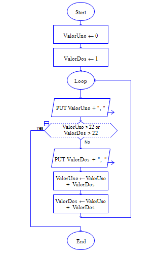
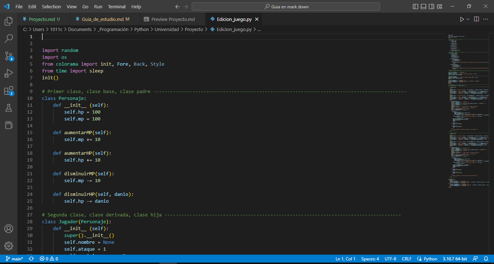
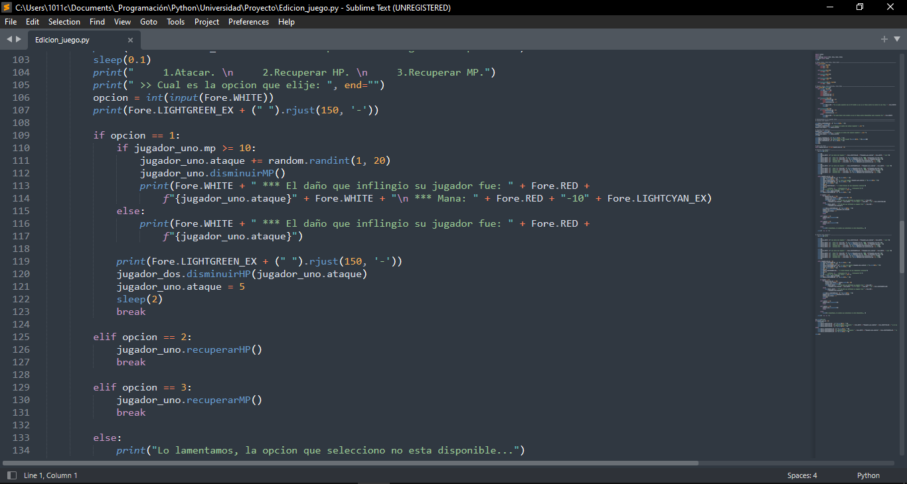

 

### UNIVERSIDAD MEXIQUENSE DEL BICENTENARIO
### UNIDAD DE ESTUDIOS SUPERIORES SAN JOSÉ DEL RINCÓN
## **FUNDAMENTOS DE PROGRAMACIÓN**
# **GUÍA DE LENGUAJES**
### **CARRERA:** INGENIERÍA EN SISTEMAS COMPUTACIONALES
### **ALUMNO:** MIGUEL ÁNGEL PASCUAL MARTÍNEZ
### **DOCENTE:** EDUARDO BECERRIL ROMERO 
### **GRUPO:** 13SC111

---
## **INTRODUCCIÓN**
El presente proyecto es realizado en el primer semestre universitario de la carrera de Ingeniería en Sistemas Computacionales, elaborado en la última evaluación parcial de la asignatura **Fundamentos de Programación**. Este proyecto tiene la finalidad de transmitir conocimienos básicos sobre la programación a las personas que han decidido adentrarse en el mundo de la programación, o que estan iniciando una carrera universitaria afín. El proyecto ayuda al lector a informarse sobre las herramientas que puede usar para el desarrollo de software y las alternativas con las que cuenta.

---
## **OBJETIVOS**
1. Brindar al lector información escencial que le aporte conocimientos básicos pero escenciales si desea integrarse al desarrollo de software.
2. Informar sobre algunos de los paradigmas de programación que existen.
3. Proporcionar información importante de lenguajes de programación que estan teniendo más impacto en el mundo de la programación.
4. Dar a conocer algunos ejemplos de algoritmos desarrollados en diferentes lenguajes de programación.

---
## **ÍNDICE**

---
## **CONCEPTOS BÁSICOS**
## PROGRAMACIÓN
### ¿QUÉ ES?
La programación es el proceso de darle instrucciones a un computador para que éste realice una tarea en especifico, las instrucciones son dadas a través de software de desarrollo conocido mejor como lenguaje de programación.

### HISTORIA
La programación como tal con un lenguaje de programación se dió por primera vez en 1957 con el científico John W. Backus, cuando creó el primer lenguaje de programación de alto nivel para entonces, Fortran. Su finalidad era clarificar y facilitar la comprensión (ante los lenguajes erráticos e indescifrables de la época), acercándolo a una notación matemática normal.
Más tarde, en 1964 nació BASIC, familia de lenguajes de programación que surgió como una herramienta de apoyo enfocada a la enseñanza pero que acabo adquiriendo una relevancia sorprendente, hasta el punto de que, a día de hoy, sigue siendo utilizado en programas como “Gambas” o “Visual Basic”.
En 1970 tuvo lugar la creación de Pascal, que al igual que BASIC, nació como una herramienta de enseñanza que pronto pasó a utilizarse para el desarrollo de aplicaciones. A pesar de que su influencia se ha visto reducida con el paso del tiempo, se sigue utilizando sobre todo en escuelas de programación.
En 1972 llegó el lenguaje C, y el resto es historia. C fue creado por Dennis Ritchie como un lenguaje básico de programación, de un nivel no muy complejo, que pronto adquiriría una relevancia vital, hasta acabar convirtiéndose en uno de los lenguajes más utilizados en la actualidad.
Finalmente en 1979 tiene lugar otro hito histórico para la programación: se crea el lenguaje C++ con la idea de añadir al lenguaje C mecanismos para manipular objetos.
Con la llegada de 1990 y la década de internet, fueron numerosos los nuevos lenguajes de programación que surgieron. Muchos de ellos alcanzaron una gran popularidad y siguen siendo masivamente utilizados actualmente. Entre ellos destacamos algunos como HTML, Python, Visual Basic, Java, JavaScript o PHP que están presentes en casi la totalidad de páginas web y aplicaciones en la actualidad.
Finalmente, desde la entrada en el siglo XXI, la creación de lenguajes de programación se ha visto mermada como consecuencia de la gran completitud de los lenguajes ya diseñados. Hechos relevantes fueron los siguientes:
Creación de C# en 2001.
Scratch, lenguaje de programación creado en 2006 con una complejidad más reducida para facilitar un aprendizaje más visual para niños, adolescentes y adultos.
Go de Google en 2009
Kotlin en 2012, hoy bautizado como uno de los mejores lenguajes para programar en Android.
Swift en 2013, creado por Apple para programar en iOS.
Actualmente, son muchos los lenguajes de programación utilizados, cada uno especializado en una función diferente. 

## ALGORITMOS
En pocas palabras, un algoritmo son los pasos a seguir para dar solución a un determinado problema, es preciso, claro y finito, es decir tiene un inicio y un final.

## DIAGRAMAS DE FLUJO
Un diagrama de flujo es la representación gráfica de un algoritmo, un diagrama de flujo esta constituido por diferentes figuras, cada una simbolizando algo en espeficico, por ejemplo los ovalos representan el inicio y final del diagrama, un rectángulo representa un proceso, un romboide representa una entrada o salida de datos, un rombo simboliza una decisión y las flechas son usadas para dar a conocer el sentido del flujo del diagrama. 

## LENGUAJE DE PROGRAMACIÓN
El lenguaje de programación es un software de desarrollo, el cual es utilizado para poder darle instrucciones a un computador para que realice tareas indicadas por un programador. Existen distintos lenguajes de programación, cada uno con un cierto proposito y con una forma diferente o similar de especificar las instrucciones, esto se le conoce como sintaxis, y por lo general es parecido al lenguaje humano, sin embargo algunos lenguajes de programación tienen su sintaxis más parecida al lenguaje máquina, con esto se puede diferenciar al lenguaje de programación entre un lenguaje de alto nivel (más parecido al lenguaje humano y es fácil de comprender) y lenguaje de bajo nivel (más parecido al lenguaje máquina y es un poco complejo de entender). Otra manera en que se clasifican los lenguajes de programación es en base a su forma de ejecución, se dividen en lenguajes de programación compilados e interpretados.

## PARADIGMAS DE PROGRAMACIÓN
Un paradigma de programación es tan solo la manera o estilo en que se programa, puede ser usando objetos, eventos, procedimientos, funciones, entre otras cosas, pero algunas de las más conocidas son las siguientes:

### PROGRAMACIÓN ORIENTADA A OBJETOS
La programación orientada o objetos o POO consiste en la implementación de objetos para dar solución a la problematica que se quiere resolver. Un objeto es la abstracción de un elemento de la vida real, éste tiene un identificador, atributos y comportamientos. La POO posee cuatro pilares, los cuales son la encapsulación, la abstracción, el polimorfismo y la herencia.

### PROGRAMACIÓN ORIENTADA A EVENTOS
En la programación orientada a eventos se encuentran tres elementos importantes, los eventos, los componentes y los metodos. Es un paradigma el cual se enfoca en funcionar dependiendo de los sucesos o acciones que ocurren en el programa y que son causados por los usuarios o por el programa. Los eventos son las acciones que ocurren, como dar clic sobre algo, introducir texto, etc, y cada acción es hecha por el usuario o el mismo programa, los componentes son los elementos con los cuales se puede interactuar y causar un tipo de evento en cada uno, y por ultimo los metodos son las funciones que cada elemento posee, por ejemplo un cuadro de texto, al ingresar un texto, éste puede tener un metodo que lo almacene, otro que lo borre, otro que lo evalue, etc.

### PROGRAMACIÓN REACTIVA
La programación reactiva es un paradigma enfocado en el trabajo con flujos de datos finitos o infinitos de manera asíncrona. Algunos de los elementos escenciales que los programas reactivos deben tener es que deben ser:  
**Responsivos:** deben de asegurar la calidad del servicio cumpliendo unos tiempos de respuesta establecidos.  
**Resilientes:** mantenerse responsivos incluso cuando se enfrentan a situaciones de error.  
**Elásticos:** mantenerse responsivos incluso ante aumentos en la carga de trabajo.  
**Orientados a mensajes:** minimizan el acoplamiento entre componentes al establecer interacciones basadas en el intercambio de mensajes de manera asíncrona.  
La motivación detrás de este nuevo paradigma procede de la necesidad de responder a las limitaciones de escalado presentes en los modelos de desarrollo actuales, que se caracterizan por su desaprovechamiento del uso de la CPU.

## LENGUAJES COMPILADOS
Los lenguajes de programación compilados son aquellos que deben pasar a través de un copilador que convierte los codigos dados por el programador a un lenguaje que el ordenador pueda comprender, de esta manera la ejecución de los programas suele ser mas rápida en comparación de los lenguajes interpretados.  
  

## LENGUAJES INTERPRETADOS
Los lenguajes de programación interpretados son aquellos que no necesitan pasar a través de un compilador, por lo que al ejecutarse, un interprete va interpretando el código línea por línea del programa en el momento de la ejecución, esto hace que su ejecución sea más lenta que la de los lenguajes compilados, pero con el paso del tiempo se ha ido haciendo cada vez más rapida en su ejecución.  
  

## **EDITORES DE TEXTO**
## VISUAL STUDIO CODE
Visual Studio Code (VS Code) es un editor de código fuente desarrollado por Microsoft. Es software libre y multiplataforma, está disponible para Windows, GNU/Linux y macOS. VS Code tiene una buena integración con Git, cuenta con soporte para depuración de código, y dispone de un sinnúmero de extensiones, que básicamente te da la posibilidad de escribir y ejecutar código en cualquier lenguaje de programación.

)

## ATOM
Atom es un editor de código de fuente abierta para macOS, Linux, y Windows con soporte para plug-ins escrito en Node.js, Incrustando Git Control, desarrollado por GitHub. Es una aplicacion de escritorio construida utilizando tecnologias web. Está basado en Electrón (Anteriormente conocido como Atom Shell),Un framework que permite aplicaciones de escritorio multiplataforma usando Chromium y Node.js. También puede ser utilizado como un entorno de desarrollo integrado (IDE).

## SUBLIME TEXT
Sublime Text es un editor de texto para escribir código en casi cualquier formato de archivo. Está especialmente pensado para escribir sin distracciones. Es decir, que visualmente ofrece un entorno oscuro donde las líneas de código que escribas resaltarán para que puedas centrarte exclusivamente en ellas. De una forma sencilla podemos decir que Sublime Text, es un editor de texto ligero, pensado desde un inicio en la velocidad, haciendolo uno de los editores de texto más rápido y facil de usar. Además de la velocidad se tiene más de 1000 de plugins adicionales y todos de codigo abierto, con una comunidad de desarrolladores que día a día contribuyen desarrollando nuevos plugins los cuales proveen de mas funcionalidad a este progrema. Sublime Text es multiplataforma, disponible para Linux, Windows y XO S. Es un programa de pago, la licencia individual cuesta 70$ aunque se puede descargar una versión de prueba que tiene tiempo ilimitado.

## **GUÍA DE LENGUAJES**
## PYTHON
### ¿QUÉ ES PYTHON?
Python es un lenguaje de programación de alto nivel, esta clasificado entre los lenguajes interpretados, pero también puede ser compilado para ejecutarse, soporta paradigmas como la POO, su sintaxis es muy parecida al lenguaje natural, por ello se considera como lenguaje de alto nivel, además con Python se pueden programar diversidad de programas, tales como páginas web, aplicaciones, e incluso inteligencia artificial. 

### PARADIGMAS QUE SE PUEDEN IMPLEMENTAR
Python es un lenguaje de programación multiparadigma, es decir que soporta varios paradigmas de programación (programación orientada a objetos, programación orientada a procedimientos y programación funcional).

### APLICACIONES COMUNES DEL LENGUAJE
Python es utilizado por empresas de todo el mundo para construir aplicaciones web, analizar datos, automatizar operaciones y crear aplicaciones empresariales fiables y escalables, además de que también suele ser muy usado para crear AI.

### PROS Y CONTRAS VS OTROS LENGUAJES
**Ventajas:**
* Lenguaje de alto nivel
* Multiparadigma
* Posee diversas bibliotecas y frameworks
* Portablilidad
* Gratis y de código abierto
* Baja curva de aprendizaje
* Comunidad fuerte

**Desventajas:**
* Lentitud
* Consumo de memoria
* Desarrollo móvil

